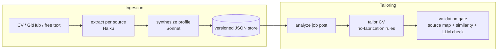

# Resume-Builder

AI – LLM-Powered Personalized Resume Builder

Ingests your career sources (CV `.docx`/`.pdf`, GitHub profile, free text) into one
canonical **career profile**, then — given any job posting — generates a
**tailored CV** that emphasizes relevant experience **without fabricating
anything**. Every generated claim is traced back to a source document; anything
that can't be traced is flagged for your review instead of silently shipped.

## How it works

Two LangGraph pipelines behind a FastAPI service:



- **Traceability** — every bullet/skill maps back to the document it came from.
- **Conflict surfacing** — when sources disagree (e.g. two start dates), the
  conflict is returned to you, never silently resolved.
- **Validation gate** — tailored claims that can't be traced to your profile
  come back as `needs_review` flags.

## Setup

Requires Python 3.11+ and an Anthropic API key.

```bash
python3.11 -m venv .venv && source .venv/bin/activate
pip install -r requirements.txt
cp .env.example .env      # fill in ANTHROPIC_API_KEY
```

Or with Docker (single container, profiles persisted in `./data`):

```bash
cp .env.example .env      # fill in ANTHROPIC_API_KEY
docker compose up --build
```

## Usage

Start the server (`uvicorn src.api.main:app --reload` locally, or the Docker
command above), then open `http://localhost:8000/docs` for the interactive
API UI, or use curl:

> To access from another machine on your network, bind to all interfaces:
> `uvicorn src.api.main:app --reload --host 0.0.0.0 --port 8000`
> (Docker Compose already does this.)

```bash
# 1. Build your career profile from any mix of sources
curl -F "cv=@resume.docx" -F "github_username=your-gh-user" \
     -F "free_text=I also mentor junior developers." \
     localhost:8000/ingest
# -> {"profile_id": "...", "version": 1, "profile": {... "conflicts": [...]}}

# 2. (Optional) review/edit the profile — each save creates a new version
curl localhost:8000/profile/<profile_id>
curl -X PUT localhost:8000/profile/<profile_id> -H 'content-type: application/json' -d @edited-profile.json

# 3. Tailor a CV for a job post
curl -X POST localhost:8000/tailor -H 'content-type: application/json' \
     -d '{"profile_id": "<profile_id>", "job_post": "<paste the job posting>"}'
# -> tailored_cv + validation.flags (review anything with needs_review: true)
```

## Tests

```bash
pytest tests/unit/ -v     # unit tests — all LLM calls mocked, no network
pytest -m integration     # end-to-end against the real Anthropic API
```

## Documentation

| Doc | Contents |
|---|---|
| [PRODUCT-GUIDE.md](PRODUCT-GUIDE.md) | User flows, guardrails, current limitations |
| [OPERATIONS.md](OPERATIONS.md) | Full setup, environment variables, deployment |
| [API-REFERENCE.md](API-REFERENCE.md) | Endpoint reference (REST + SSE) |
| [TECHNICAL-DESIGN.md](TECHNICAL-DESIGN.md) | Architecture and agent design |
| [PLAN.md](PLAN.md) | Phase roadmap (LinkedIn ingest, document rendering, review UI) |
| [HISTORY.md](HISTORY.md) | Change log |
