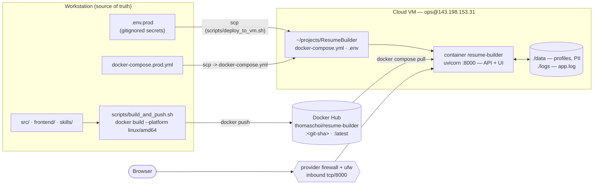
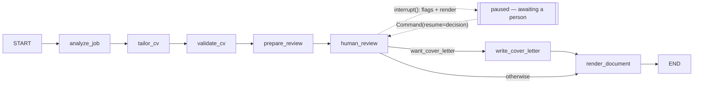
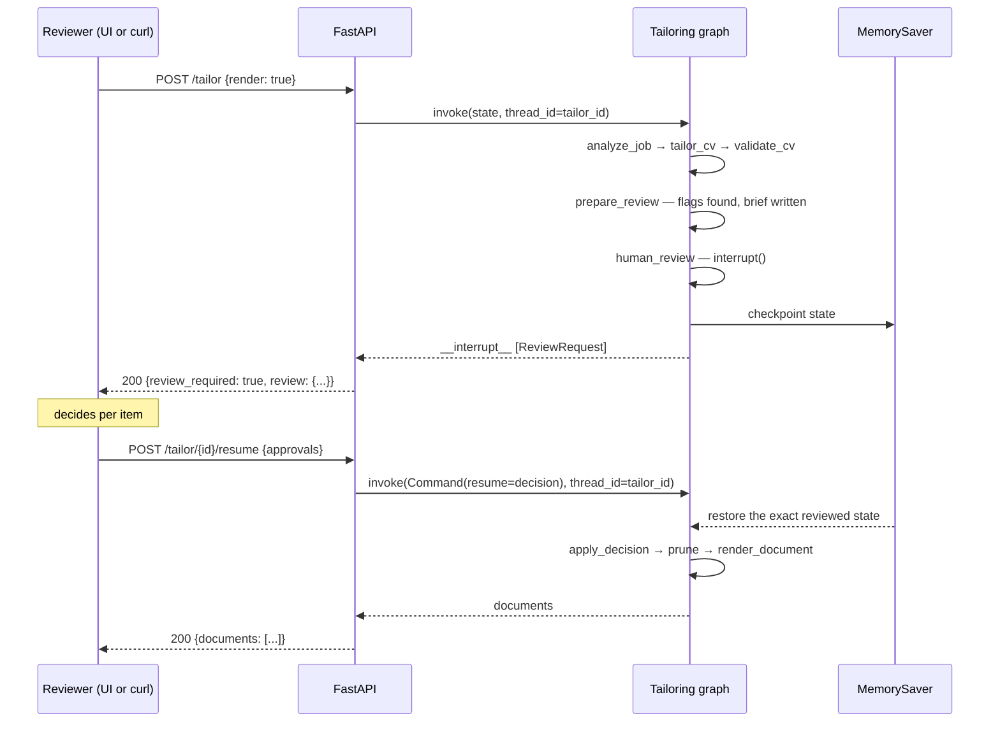
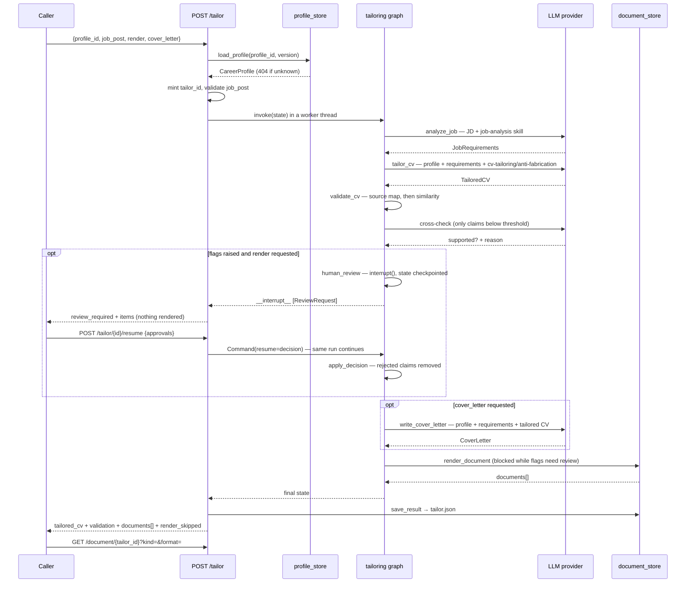
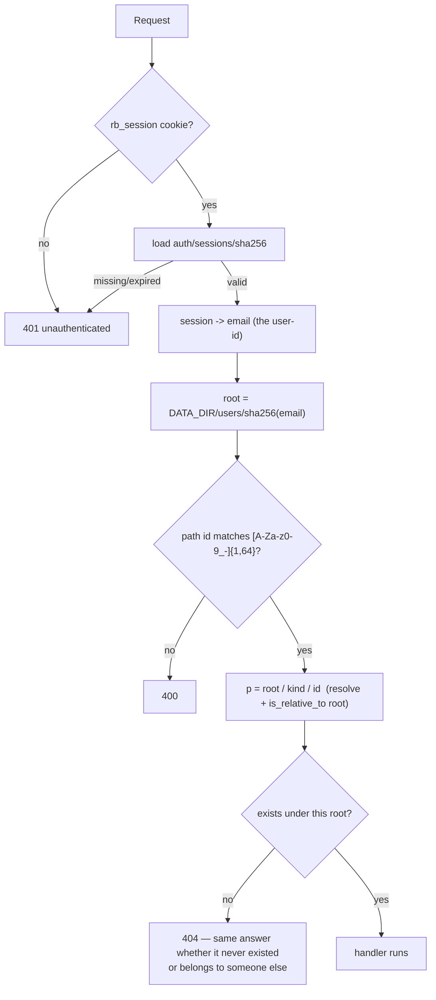

# Career Profile & Targeted CV Generator — Agent Design

## 1. Goal

Two-stage pipeline:

1. **Ingest** LinkedIn, GitHub, CV (docx/PDF), and free text → produce a single canonical **Personal Career Summary** (structured JSON + narrative).
2. **Target** — given a job post, use that summary to generate a **tailored CV** (and optionally a cover letter) that emphasizes relevant experience without fabricating anything.

This maps cleanly onto your existing Orchestrator/Analytic/Coding-style agent pattern — same LangGraph graph-of-agents shape, different domain.

---

## 2. Agent topology

```
                        ┌────────────────────┐
                        │   Orchestrator      │
                        │  (LangGraph graph)   │
                        └─────────┬───────────┘
              ┌───────────────────┼────────────────────┐
              ▼                   ▼                     ▼
      ┌───────────────┐   ┌───────────────┐    ┌────────────────┐
      │ Ingestion Agent │   │ Extraction    │    │ Synthesis Agent │
      │ (per-source)    │──▶│ Agent (LLM)   │──▶ │ (LLM)           │
      └───────────────┘   └───────────────┘    └────────┬────────┘
                                                          ▼
                                                 ┌─────────────────┐
                                                 │ CareerProfile    │
                                                 │ (canonical JSON) │
                                                 └────────┬────────┘
                                                          │
                        ┌─────────────────────────────────┘
                        ▼
              ┌───────────────────┐        ┌────────────────────┐
              │ Job Analysis Agent │───────▶│ CV Tailoring Agent  │
              │ (parses job post)  │        │ (LLM, generates CV) │
              └───────────────────┘        └──────────┬─────────┘
                                                        ▼
                                              ┌───────────────────┐
                                              │ Validation Agent   │
                                              │ (no-fabrication    │
                                              │  check + ATS check)│
                                              └──────────┬─────────┘
                                                          ▼
                                              ┌───────────────────┐
                                              │ Review Agent       │
                                              │ (interrupt() for a │
                                              │  human on flags)   │
                                              └──────────┬─────────┘
                                                          ▼
                                              ┌───────────────────┐
                                              │ Document Agent     │
                                              │ (docx/pdf render)  │
                                              └───────────────────┘
```

Each box is a node in a LangGraph `StateGraph`, same as your Backtesting/Discovery agents — this keeps it consistent with FUND's existing conventions (per-agent `SKILL.md`, shared Pydantic state, `interrupt()` for human review before final CV output).

---

## 3. Stage 1 — Ingestion Agents (per source)

Each source gets its own thin ingestion node that normalizes raw input into text/JSON before the LLM ever sees it. Keep parsing deterministic (no LLM) where possible — cheaper and more reliable.

| Source | Method | Notes |
|---|---|---|
| **LinkedIn** | User-provided **data export** (Settings → "Get a copy of your data") or manual paste of profile text | LinkedIn's ToS blocks scraping and there's no public profile-read API for personal apps — don't build a scraper. The official export gives you Positions, Education, Skills, Certifications, Recommendations as CSV/JSON. Implemented in Phase 2 (`src/tools/linkedin_export.py`) — see below. |
| **GitHub** | GitHub REST/GraphQL API (`api.github.com`) — repos, README content, languages, commit stats, pinned repos | You already have `api.github.com` in your allowed domains. Pull repo descriptions + top languages + README excerpts, not full source — keep token cost down. Coverage spans owned, organization, and contributed-to repos — see below. |
| **CV (docx)** | `python-docx` / your docx skill's read path | Extract text preserving section structure (headers as section boundaries). |
| **CV (PDF)** | `pdfplumber` or the pdf-reading skill | Watch for two-column CVs — plain text extraction can interleave columns; consider layout-aware extraction or page rasterization + vision fallback for complex layouts. |
| **Free text / paste** | Passthrough | e.g. person pastes bio or notes directly. |

Output of this stage: a list of `SourceDocument { source_type, raw_text, structured_fields? }`.

### GitHub source coverage & the attribution contract (Phase 1.f, 2026-07-21)

`/users/{u}/repos?type=owner` returns *only* repos under the personal username,
so work done inside organizations and contributions to other people's repos —
for many engineers the majority of their real output — were invisible. The
client (`src/tools/github_client.py`) now collects three tiers:

| Tier | Source | Detail fetched |
|---|---|---|
| **Owned** | the repo listing below, partitioned by `owner.login == u` | description, primary language, stars, `languages`, README excerpt |
| **Organization / collaborator** | the same listing's non-owned rows that pass the contribution probe, attributed to their owner; the org listing distinguishes *member of* from *collaborator on* | same as owned |
| **External contributions** | with `GITHUB_TOKEN`: GraphQL `user.repositoriesContributedTo(includeUserRepositories:false)` + `contributionsCollection.commitContributionsByRepository` (⚠️ defaults to the **last 12 months** — looped per year); without: REST `GET /search/issues?q=author:{u}+type:pr+is:merged`, aggregated per repo | contribution scope ("6 merged PRs; 41 commits") + PR titles, and **no README excerpt** |

Forks stay excluded — a fork is not evidence; the merged PR it produced is.
`GET /search/commits` is rejected: it counts forks and mirrors (57,068 "commits"
for a user with 778 real commit contributions).

**Attribution contract (anti-fabrication).** Rendering `pallets/flask` under the
same bare `## Repository:` heading as the user's own project invites synthesis
to credit them with the whole framework. So the source document is structured
into explicitly labelled sections — `## Owned repositories`,
`## Organization repositories (member of|collaborator on <org>)`, and
`## Contributions to external repositories (not owned by the user)` — external
entries are marked `(owned by others)` and carry only the contribution
evidence, and `skills/source-extraction/SKILL.md` gains an "Ownership vs.
contribution" rule: a contribution to a repo the user does not own is evidence
of *that contribution*, never of authorship or ownership of the project. README
excerpts are quoted line-by-line (`> `) because READMEs carry their own `##`
headings, which would otherwise read as section boundaries of this document and
blur the very labelling the contract depends on.

**Budget & degradation.** READMEs/languages are fetched only for owned and org
repos; external repos are ranked by contribution volume (not `updated`) and
capped by `GITHUB_MAX_EXTERNAL_REPOS`; the merged-PR search is paged once. A
403/429 on search logs a `WARNING` and degrades to owned + org repos rather than
failing the ingest, and `GITHUB_INCLUDE_CONTRIBUTIONS=false` skips the extra
calls entirely.

### Membership privacy & the contribution probe (Phase 1.g, 2026-07-21)

Phase 1.f was verified against public API responses, which hid two facts that
made its organization tier both incomplete and noisy.

**Private membership is the default.** `GET /users/{u}/orgs` returns *public*
memberships only. For the reference account it returned `[]` while the user
belonged to five organizations — so tier 2 could only ever surface the handful of
public org repos that happened to appear in the public repo listing, and the
document silently understated the user's entire employment history. Worse, the
14 repos Phase 1.f proudly labelled "external contributions **not owned by the
user**" were mostly repos of the user's *own companies*: unable to see the
affiliation, the client had inverted the attribution and undersold them.

The fix is a **self-token** path. `GET /user` resolves the token's identity on
every run; when it matches the ingested username the client switches to the
viewer endpoints, which see private memberships and private repos:

| | Third-party / no token | Self-token |
|---|---|---|
| Orgs | `GET /users/{u}/orgs` (public only) | `GET /user/orgs` |
| Repos | `GET /users/{u}/repos?type=all` | `GET /user/repos?affiliation=owner,organization_member,collaborator` (paged) |

The identity check is what makes this safe: a token issued to anyone other than
the ingested username never reaches a viewer endpoint, so it cannot surface a
third party's private data. `GITHUB_INCLUDE_PRIVATE=false` keeps private repos
out of the document while still discovering the memberships, and private repos
that are included are rendered with a `Visibility: private` line so tailoring
never offers one as a public portfolio link.

**Access is not contribution.** The same listing exposes the opposite failure:
`affiliation=collaborator` returns every repo the user was ever invited to. For
the reference account that was 88 repos, of which the user had committed to
exactly **one**. Rendering them all would hand the extractor 87 other people's
projects to write achievements from — a fabrication risk larger than the one the
labelled sections were built to solve. Every non-owned repo therefore has to
prove itself:

- repos already proven by the merged-PR search or the GraphQL commit counts pass
  for free;
- the rest cost one `GET /repos/{full}/commits?author={u}` probe each, bounded by
  `GITHUB_MAX_CONTRIBUTION_PROBES`; anything unproven is dropped, never assumed.

The GraphQL commit map was evaluated as the sole filter and rejected: it found 8
of the 26 repos the user had really committed to, because
`contributionsCollection` counts only default-branch commits under a matching
account email. The REST probe found all 26.

Survivors are capped by `GITHUB_MAX_ORG_REPOS`, most recent contribution first,
but **each organization keeps at least one repo before recency fills the rest** —
a straight recency sort dropped two 2021-era employers entirely, and a resume
needs the breadth of employers more than a fifth repo from the current one.

### Batched per-repo GitHub extraction (Phase 5.c, 2026-07-22)

The two-tier resilience of Phase 1.e has a hole exactly where GitHub sits. One
`github_username` renders **one** `SourceDocument` holding every repo, so the
item-level salvage in `extract_one` only helps when the model returns a *parseable
but invalid* tool call. When it returns a message with **no tool call at all** —
which ~49k chars of input asking for ~50 repos of structured output made likely —
there is nothing to salvage from, and the source-level net in `extract_source`
can only drop the whole document. A real run lost 50 repos that way, and still
returned 200 with a success banner.

The fix is to stop asking for all of it at once:

1. **Split.** `github_client.split_repo_sections` cuts a rendered document into
   one `RepoChunk` per `### Repository:` section, and `render_repo_document`
   reassembles any subset. The spans tile the document exactly, so
   `render(split(text)) == text` — re-rendering an untouched document is a no-op,
   which is what makes the pruning below safe to trust. Both live in
   `github_client.py`, beside the rendering they invert, so the format is
   described in exactly one file.
2. **Every chunk carries its tier heading.** `skills/source-extraction/SKILL.md`
   decides ownership-vs-contribution attribution from the `## Owned repositories`
   / `## Organization repositories (…)` / `## Contributions to external
   repositories (not owned by the user)` labelling. A chunk extracted without its
   heading would be read as authorship — the batching would otherwise have
   re-opened the exact fabrication risk Phase 1.f closed.
3. **Batch, then isolate.** `_extract_github` sends
   `GITHUB_REPOS_PER_EXTRACTION` repos per call. A failed batch is retried **one
   repo at a time**, so the blame lands on a specific repository instead of on
   its forty-nine neighbours. Per-batch extractions merge by concatenating the
   list fields; `name`/`headline`/`contact` take the first non-empty value.
   Duplicates across batches are left to synthesis, which already dedupes.
   Raising only when *every* repo fails preserves the Phase 1.e rule that a
   silently empty profile is worse than an error.

**Synthesis is deliberately out of scope.** It still funnels every project
through one LLM call that must re-emit them all — the same output-size fragility
one stage later. It is left alone until extraction is demonstrably reliable,
rather than fixed speculatively.

**The archive splits in two.** `data/sources/{run_id}/github/github.json` is
rewritten after extraction to hold only the repos that reached the profile, and
the as-fetched document is preserved beside it as `github.raw.json` with its own
manifest entry (`{source_id}#as-fetched`). Pruning the archive without keeping
the original would destroy the evidence needed to investigate the drop. The
rewrite happens in `store_profile`, the node that already owns run-store I/O, fed
by the new `IngestionState.pruned_sources`; `extract_source` stays a pure LLM
step. Nothing is written when nothing was dropped.

**Partial success is never silent.** `IngestionState.source_errors`
(`{"source", "repo", "reason"}`) propagates to the `/ingest` response and streams
as `warning` SSE events, and the UI lists the skipped repos and qualifies its
success banner. That a run could lose a whole source and still render as a clean
success is what made this bug expensive to find, so the reporting is part of the
fix rather than a nicety. Correspondingly, a response with no tool call now logs
`finish_reason`, usage and a content preview — the old code logged the empty
`parsing_error` as literally `: None`.

### Per-request GitHub token (Phase 5.a, 2026-07-21)

Phases 1.f/1.g read the token from the module-global `config.GITHUB_TOKEN`,
bound once at import. One process therefore served exactly one credential, and —
because the self-token identity check derives from that same global — exactly
one user could ever have their private repos read. Ingesting a second username
with *their* token meant editing `.env` and restarting.

The token is now a parameter, threaded from `fetch_github_profile(username,
client=None, token=None)` down through `_headers`, `_viewer_login`, `_graphql`
and `_gather_evidence`, and resolved as `token or config.GITHUB_TOKEN` at the
top of the fetch. `POST /ingest` exposes it as a `github_token` form field
(blank → `None` → the configured fallback), so env-only deployments behave
exactly as before.

What this does **not** change is the safety property from 1.g: the
`GET /user` identity check simply runs per request instead of per process, so
user B's token unlocks B's private repos while a token belonging to neither
party still never reaches a viewer endpoint. What it adds is a handling
obligation — the token is a secret in transit, so it is deliberately absent from
`manifest.json`, from the archived `github.json`, and from every log line (the
existing `github[%s]: token viewer=%s` DEBUG line logs the *resolved login*,
which is exactly the non-secret part worth having). It is held nowhere after the
request: not in `data/`, and in the UI not in `localStorage` either.

### Same-named uploads stay distinct (Phase 5.b, 2026-07-21)

`run_store.save_source_file` wrote to `sources/{run_id}/{category}/{filename}`,
so two uploads named `CV.docx` overwrote each other. The quieter half of the bug
was in `routes._load_upload`, which derived `doc.id = f"{source_type}:{filename}"`
from the *uploaded* name: the two sources also collided as source ids, and
`CareerProfile.raw_source_map` — the map the anti-fabrication gate reads to trace
a claim back to its document — lost the ability to tell them apart.

`save_source_file` now suffixes a taken name (`CV.docx` → `CV-2.docx` → …) and
returns the path it actually wrote, and both `_load_upload` and
`_load_linkedin_export` build `doc.id` from `stored.name`. Deriving the id from
the storage layer's answer rather than the request's is what keeps the two in
step: the archive and the traceability map can no longer disagree about how many
sources there were.

### LinkedIn data-export ingestion (Phase 2, 2026-07-21)

`src/tools/linkedin_export.py` parses the archive the person downloads from
LinkedIn themselves (or individual CSVs from it). Deterministic, offline, and
**no scraping** — there is no network call in this module at all, which is the
design constraint above expressed as code.

One upload → one `SourceDocument` (`source_type="linkedin"`,
`id="linkedin:<filename>"`) carrying both representations of the same data:

| Field | Contents | Consumer |
|---|---|---|
| `structured_fields` | Exported rows verbatim, grouped into `profile`, `positions`, `education`, `skills`, `certifications`, `recommendations_received` | The extraction prompt, as **authoritative records** |
| `raw_text` | Deterministic Markdown rendering of the same sections | The extraction prompt as readable context; also what a human sees in the archive |

Both are sent. The records are what the model must follow; the rendering keeps
a LinkedIn source shaped like every other source in the pipeline (and readable
in `data/sources/{run_id}/`). The duplication costs tokens on a large export
and is accepted for that reason.

Two properties of the real export drive the parser:

- **File names drift between export versions** (`Recommendations_Received.csv`
  vs `Recommendations Received.csv`), so a section is matched on a *normalized*
  stem (lowercased, non-alphanumerics collapsed), not an exact filename.
  Unrecognized members (ads, messages, connections) are skipped with a DEBUG
  log rather than guessed at.
- **Several CSVs open with a free-text `Notes:` preamble** before the header
  row, so the header is located by its columns (`Company Name`/`Title` for
  positions, etc.) instead of being assumed to be line 1. Blank cells are
  dropped rather than stored as `""`, so an absent field stays absent — the
  same contract §4's nullable-field rules enforce downstream.

An export with no recognizable section raises `ValueError` → HTTP 400, rather
than ingesting an empty source. The upload is archived *before* parsing (as CVs
are), so even a rejected export is on disk to inspect.

**Attribution.** Two exported record types are not the person's own claims and
are labelled as such in the rendering and in `skills/source-extraction/SKILL.md`:
profile **skills** are self-asserted (a skill, never an achievement), and
**recommendations** are written by other people (rendered under
"Recommendations received (written by other people)" with the author named).
This is the same anti-fabrication discipline the GitHub tier labelling above
exists to enforce.

---

## 4. Stage 2 — Extraction Agent (LLM)

One LLM call per source (or batched), converting messy raw text into a **common schema**. This is the "normalize" step — same idea as your Analytic Agent turning unstructured strategy docs into structured summaries.

```python
class Experience(BaseModel):
    company: str
    title: str
    start_date: str | None
    end_date: str | None
    location: str | None
    bullets: list[str]          # verbatim-ish achievements, not embellished
    source: str                 # "linkedin" | "cv" | "github"

class Project(BaseModel):
    name: str
    description: str
    technologies: list[str]
    role: str | None
    url: str | None
    source: str

class Skill(BaseModel):
    name: str
    category: str                # "language" | "framework" | "domain" | "tool"
    evidence_count: int          # how many sources/repos/roles support this

class CareerProfile(BaseModel):
    name: str
    headline: str | None
    contact: dict
    experiences: list[Experience]
    projects: list[Project]
    education: list[dict]
    skills: list[Skill]
    certifications: list[str]
    summary_narrative: str        # 2-3 paragraph human-readable synthesis
    raw_source_map: dict[str, str]  # traceability: claim -> source doc
```

Key design choice: **every field keeps a `source` pointer.** This is what makes stage 3's anti-fabrication check possible — you can always trace a bullet back to a real document.

### Structured-source prompt variant (Phase 2, 2026-07-21)

Most sources are prose (a CV, a README, pasted notes) and the model has to read
them. A LinkedIn data export is not: it is rows the person exported. So
`extraction_prompt` gained a `{structured}` slot, filled by
`extraction._structured_block` only when `SourceDocument.structured_fields` is
present, that hands the model the records as JSON and states they are
authoritative over the rendered text below them. Prose sources get an empty
block, so their prompt is byte-for-byte what it was before — one prompt module,
one node, no LinkedIn-specific branch in the graph.

### Nullable-field contract (Phase 1.e, 2026-07-21)

The anti-fabrication skill instructs the model to *leave an absent field empty
rather than invent a value*, so `null` is a **correct** extractor output, not an
error. The schema is therefore what yields: extraction-facing fields carry a
`mode="before"` validator (`NullableStr` → `""`, `NullableList` → `[]`, in
`src/models/schemas.py`) so a `null` coerces instead of rejecting the whole
payload.

| Model | Null-tolerant fields |
|---|---|
| `Experience` | `company`, `title`, `source`, `bullets` |
| `Project` | `name`, `description` (also defaults to `""`), `source`, `technologies` |
| `Skill` | `name`, `category` |
| `JobRequirements` | `required_skills`, `preferred_skills`, `responsibilities`, `keywords_for_ats` |

Models that are **not** LLM-extraction targets — `TailoredCV`, `ValidationFlag`,
`ValidationResult`, `CoverLetter` — stay strict: a `null` there is a real bug and
must still raise. `SKILL.md` is deliberately unchanged.

Ripple: `synthesis.build_raw_source_map` skips falsy claims, because once
descriptions can be `""` every description-less project would otherwise collide
on a single `""` key in the map the validation gate reads.

### Two-tier extraction resilience (Phase 1.e)

One `github_username` yields exactly **one** `SourceDocument` holding all repos,
so resilience at the source level cannot save individual repos. Two tiers:

1. **Item-level salvage** (`extract_one`, the primary net). The strict
   `SourceExtraction` remains the tool schema handed to the model — it is what
   steers the output — but the call uses `with_structured_output(...,
   include_raw=True)`, which *surfaces* a `ValidationError` in
   `{"parsed", "raw", "parsing_error"}` instead of raising. On the failure path
   the extraction is rebuilt from `raw.tool_calls[0]["args"]` field by field,
   validating `experiences`/`projects`/`skills` **one element at a time** and
   dropping only the failures (logged at WARNING with list index, `name`, and
   the pydantic message). If salvage recovers nothing usable — no tool call,
   unparseable args, or every item rejected — the original error is **re-raised**:
   a silently empty profile is worse than a 500.
2. **Source-level net** (`extract_source`, coarse last resort). A hard failure
   on one source (provider error, no parseable response at all) is logged and
   skipped so the surviving sources still produce a profile; if *every* source
   fails, the error is raised. This does not save individual repos — losing a
   source here still loses that whole document.

With the nullable-field contract in place tier 1 should rarely fire; it is
defense-in-depth for the next malformed field, not the primary remedy.

**Superseded for GitHub by Phase 5.c** (§3, "Batched per-repo GitHub
extraction"): both tiers assume the model returned *something* parseable, so
neither survives a response with no tool call at all. GitHub sources are now
split into per-repo batches before either tier applies; the two tiers above still
govern every other source type, and still apply within each batch.

---

## 5. Stage 3 — Synthesis Agent (LLM)

Merges the per-source extractions into one `CareerProfile`:
- De-duplicates overlapping entries (same job listed in CV and LinkedIn).
- Resolves date/title conflicts by preferring the most detailed source, and flags conflicts back to the user rather than silently picking one.
- Writes `summary_narrative` — this is the reusable "elevator pitch" used later for tailoring.
- Infers `Skill.evidence_count` from cross-referencing GitHub language stats + CV mentions + LinkedIn skills list.

This `CareerProfile` JSON is your durable artifact — store it (Postgres/JSON file), it's what stage 2 (job targeting) consumes repeatedly without re-ingesting sources each time.

---

## 6. Stage 4 — Job Analysis Agent

Given a job post (pasted text or URL):
- Extracts: required skills, nice-to-haves, seniority level, key responsibilities, company/domain context.
- Produces a `JobRequirements` schema, same idea as `CareerProfile`.

```python
class JobRequirements(BaseModel):
    title: str
    company: str | None
    required_skills: list[str]
    preferred_skills: list[str]
    responsibilities: list[str]
    seniority: str | None
    keywords_for_ats: list[str]   # exact phrasing to mirror for ATS matching
```

---

## 7. Stage 5 — CV Tailoring Agent

This is the core generation step. Prompt structure (not code, but the shape that matters):

- **Input:** `CareerProfile` (full) + `JobRequirements`.
- **Instruction constraints** (critical, put these as hard rules in the system prompt):
  1. Only use facts present in `CareerProfile` — no new employers, dates, titles, or skills.
  2. Re-order and re-weight existing bullets toward job-relevant ones; don't invent new bullets.
  3. Rephrase bullets to mirror the job post's terminology *only when the underlying fact supports it* (e.g. if profile says "built distributed trading backtester" and job wants "distributed systems experience," it's fair to foreground that phrase — but don't claim technologies not evidenced).
  4. Select a subset of `experiences`/`projects` — not everything, prioritized by relevance score.
  5. Output structured JSON matching a `TailoredCV` schema, not raw prose — so the Document Agent can render it deterministically.

```python
class TailoredCV(BaseModel):
    headline: str
    summary: str                 # 2-4 sentences, job-specific framing
    selected_experiences: list[Experience]   # subset + reordered/reworded bullets
    selected_projects: list[Project]
    highlighted_skills: list[str]
    relevance_notes: dict[str, str]  # internal: why each item was chosen (for validation/debugging, not shown on CV)
```

---

## 8. Stage 6 — Validation Agent (anti-hallucination gate)

This is the piece worth not skipping. A second, separate LLM call (or even non-LLM diffing) that:
- Checks every bullet/skill in `TailoredCV` against `CareerProfile.raw_source_map`.
- Flags anything with no traceable source as `needs_review`.
- Optionally runs a simple string/embedding similarity check between generated bullets and original bullets to catch drift.

If using LangGraph, this is a natural `interrupt()` point — surface flagged items to the user for approval before rendering, consistent with the human-in-the-loop pattern you used in your earlier LangChain agent work.

**Implemented in Phase 4** — `human_review` sits between `validate_cv` and
rendering and calls `interrupt()`, so the run pauses with its state
checkpointed instead of handing the decision back to the client. See
"Human-in-the-loop review" under §13.

---

## 9. Stage 7 — Document Agent

Renders `TailoredCV` → `.docx` (and/or PDF) using a template. This is a pure rendering step, no LLM — use `python-docx` with a template + style, or Claude's own docx skill if this is running inside Claude Code/Claude.ai rather than as a standalone service.

### Rendering & the render gate (Phase 3, 2026-07-21)

Implemented as two pieces, deliberately split so the decision and the drawing
are separately testable:

- **`src/tools/docx_renderer.py` — pure layout.** Everything it writes already
  exists in the `TailoredCV` / `CoverLetter` that the validation gate checked,
  so the renderer never adds, rewrites, or infers content; it only lays it out.
  Section order is fixed and mirrors the schema (name/contact header → headline
  → summary → experiences → projects → skills). `relevance_notes` is internal
  tailoring reasoning and is **not** rendered; empty sections are omitted
  entirely rather than emitted as empty headings.
- **`src/agents/document.py` — the gate.** `skip_reason()` answers *whether*
  rendering may happen; `render_documents()` drives the renderer. A CV whose
  claims validation could not trace back to the profile must not quietly become
  a polished file someone sends out, so a run with `needs_review` flags renders
  **nothing** unless the caller passes `approve_flagged` (Phase 3's review is
  client-side — the caller has already seen `validation.flags` in the response;
  Phase 4 replaces this with a graph `interrupt()`).

**Templates.** `DOCX_TEMPLATE` optionally points at a base `.docx` supplying
styles/theme/letterhead; content is always *appended* by the renderer, so no
placeholder-substitution engine is needed. A template lacking the built-in
`Heading 1` / `List Bullet` styles degrades to bold/plain paragraphs instead of
raising, and a configured-but-missing template falls back to python-docx's
default with a WARNING.

**PDF.** A second, separable step: the rendered `.docx` is converted by headless
LibreOffice (`LIBREOFFICE_BIN`, shipped in the Docker image as
`libreoffice-writer`), invoked with a throwaway `-env:UserInstallation` profile
because `HOME` is not reliably writable in a container. A missing binary, a
non-zero exit, or a timeout logs a WARNING and yields `None` — the `.docx` is
the guaranteed output and a PDF is never allowed to fail a tailoring run.
`RENDER_PDF=false` skips the attempt outright.

### Cover letter (design doc §1's optional second output)

`tailoring.generate_cover_letter` is an LLM node (`COVER_LETTER_MODEL`,
defaulting to `TAILORING_MODEL`) producing the `CoverLetter` schema. It is given
the profile, the `JobRequirements` **and** the already-tailored CV: that CV is
the set of facts deemed relevant to this posting, so the letter *connects* them
rather than re-selecting from scratch. It composes the `cover-letter` skill with
`anti-fabrication` (same pattern as tailoring), so the letter is bound by the
same no-invention rules as the CV — plus two rules the letter form makes
necessary: no inventing motivations or claims about the company, and no
restating third-party recommendations as the candidate's own claims.

---

## 10. Tech stack (matches your FUND stack)

- **Orchestration:** LangGraph `StateGraph`, one node per agent above, shared Pydantic state object.
- **Backend:** FastAPI, endpoints like `/ingest`, `/profile/{id}`, `/tailor` (job post in → CV out), SSE for streaming progress on long ingestion jobs — same pattern as your ATA's 17 REST/SSE endpoints.
- **Storage:** `CareerProfile` JSON per user in Postgres (or even just versioned JSON files if single-user) so re-tailoring for new job posts doesn't re-run ingestion.
- **Models:** Haiku for extraction (cheap, high-volume, per-source), Sonnet for synthesis + tailoring (needs judgment), optionally Opus for the validation/anti-hallucination pass since precision matters most there — the same tiering strategy you're already using for subagent cost control.
- **Frontend:** could reuse your React/Vite/TanStack scaffold — a simple 3-panel UI: sources → profile review/edit → job post + generated CV diff view.

### Frontend as built (Phase 4, 2026-07-21)

React 19 + Vite + TanStack Query in `frontend/`, TypeScript throughout, exactly
the three panels above (`frontend/src/panels/`):

| Panel | Reads/writes | Notes |
|---|---|---|
| `SourcesPanel` | `POST /ingest`, `GET /ingest/{job_id}/events` | Subscribes to the SSE stream *before* POSTing, so no node event is missed. Generates its own `job_id` for that reason. File inputs **accumulate** across picks (Phase 5.b) |
| `ProfilePanel` | `GET`/`PUT /profile/{id}` | Edits a local draft (a slow save never fights the typing); each conflict's chosen value is recorded in the new `Conflict.resolution` field. Draws every stored section — contact, experience, projects, education, skills, certifications (Phase 6.d) |
| `TailorPanel` | `POST /tailor`, `GET /document/{id}` | Side-by-side profile-vs-tailored bullet table, plus the selected projects in the order the `.docx` renders them; hands a paused run to `ReviewPanel` |
| `ReviewPanel` | `POST /tailor/{id}/resume` | Per-item Keep/Remove, defaulting to Remove — the same default as the server |

Two decisions worth recording:

- **The UI ships inside the API image.** A multi-stage `Dockerfile` builds the
  bundle in a `node:20-slim` stage and copies `dist/` into the Python runtime,
  which mounts it at `/` (`FRONTEND_DIR`). One container, one origin, no CORS,
  and no Node in the shipped image. Without a build, `/` still redirects to
  `/docs`, so a backend-only checkout is unaffected.
- **The dev server's address is configuration, not code.** Because production
  has no Vite server at all, the only place a host/port matters is development —
  so `vite.config.ts` reads `UI_HOST`/`UI_PORT` (bind address) separately from
  `API_URL` (proxy target), defaulting to loopback:5173 so nothing is exposed by
  accident, with `strictPort` on so a busy port fails instead of quietly moving.
  These live in the shell, not `.env`: the backend never reads them.
- **A file input reports only the current pick (Phase 5.b).** `SourcesPanel`
  originally did `setCvFiles(Array.from(event.target.files))` on every `change`,
  which reads as "these are the files" but means "these are the files chosen in
  *this* dialog" — a second pick dropped the first. It now merges into the
  staged list, keyed on `name+size+lastModified`, renders the staged files with
  per-file remove buttons, and clears `event.target.value` after reading so
  re-picking a removed file fires `change` again. The pick must be read into a
  local *before* that clear, since the state updater runs afterwards.
- **The GitHub token field is component state only** — `type="password"`, never
  `localStorage`, and appended to the `FormData` only when non-empty.
- **The diff similarity is display-only.** `frontend/src/lib/diff.ts` scores
  bullets with a bigram Dice coefficient purely to label them
  unchanged/reworded/new. The authoritative judgement stays server-side
  (difflib + LLM cross-check); anything the gate flagged renders as flagged
  whatever the client scores.
- **The screen draws everything the profile stores (Phase 6.d).** `ProfilePanel`
  originally rendered only name, headline, summary, conflicts, experience and
  skills, so a GitHub-only ingest — 56 repos in `projects` — looked like it had
  produced nothing, which is the exact indistinguishability Phase 5.c set out to
  remove. `projects`, `education`, `certifications` and `contact` now have
  markup, and `TailorPanel` draws `selected_projects` between the bullets and
  the skills, matching `docx_renderer.render_cv`'s section order so the review
  screen and the approved document agree. Two constraints shaped it:
  `education` is `list[dict]` with **no** guaranteed keys, so entries render
  familiar keys first and list whatever else they carry rather than dropping it;
  and a 56-item list would bury the Save button, so long lists show ten with a
  "Show all *n*" toggle. `diff.ts` gained `diffProjects`, which matches by
  lower-cased name — the same key `validation.py` and `review.py` use, so a
  project the UI marks flagged is the one the gate flagged, never a near-miss
  of the client's own invention.
- **Panel state lifecycle is expressed as remounts (Phases 6.a/6.b).** Only one
  piece of state is shared — the active `profile_id` in `App.tsx`. Everything
  else (staged files, the GitHub token, the edited draft, the tailored result
  and its download links) is component-local and unreachable from the parent, so
  "start over" is not a prop threaded through four components and a dozen
  `useState`s that would drift as the panels gain fields. Instead:
  - `<SourcesPanel key={"sources-" + sessionKey}>` — a `sessionKey` counter
    bumped by **Clear everything**, which also calls
    `useQueryClient().clear()` (without it the remounted `ProfilePanel`
    redraws the previous profile instantly from cache) and is guarded by a
    `window.confirm`, since unsaved edits and a typed token go with it.
  - `<ProfilePanel>` / `<TailorPanel>` are keyed on **`sessionKey` + the active
    profile id**, so a new profile remounts both. That closes two windows at
    once: `ProfilePanel` used to keep rendering the *old* profile's headline
    under the *new* id between the id changing and the fetch landing (its
    `draft` updates only when data arrives), and `TailorPanel.result` was never
    reset at all — its diff, its pending review and its download links (which
    carry the old `tailor_id`) survived the change of profile. Sibling keys are
    prefixed because two children of one parent may not share a key.
  - **Inputs clear on success, never on click.** `SourcesPanel` empties the
    staged files, free text, token and target-profile id in the mutation's
    `onSuccess`, so a second "Build profile" cannot silently re-ingest the same
    CVs — but a *failed* run keeps everything staged, because re-picking every
    file is the wrong price for a 500. The progress list and the outcome banner
    (including the skipped repos) survive the clear: they describe the run that
    just finished, not the next one.
- **A failed refresh is not a failed load (Phase 6.c).** `ProfilePanel` tested
  `query.isError` *before* `draft`, so any failure — including a background
  refetch that React Query keeps the previous `data` through — replaced a
  profile that was already loaded and possibly edited. A one-second network
  blip cost the user their work. The fatal branch is now `isError && !draft`
  (a first-load failure must still be caught before the loading branch, or the
  panel spins for ever); with a draft in hand the failure renders as a
  `role="alert"` banner above the still-editable profile, with a Retry button
  calling `query.refetch()`. `TailorPanel` gets the same treatment where it
  matters more quietly: with no profile to diff against it used to draw an
  empty comparison table, which reads as "nothing changed" rather than "the
  comparison is missing" — a dangerous thing to believe about a CV about to be
  approved. Its banner is conditioned on `!profileQuery.data`, since a failed
  refetch still leaves the last copy to diff against.
- **The query defaults now say what the comment claimed (Phase 6.c).**
  `staleTime: 0` marked every response stale on arrival, so each new observer
  of `["profile", id]` refetched — and there are two, `ProfilePanel` and
  `TailorPanel` — while `refetchOnReconnect` (on by default) refired on any
  online/offline flicker and `retry: false` turned the first blip straight into
  an error state. `main.tsx` now sets `staleTime: 30_000`,
  `refetchOnReconnect: false` and `retry: 1`; freshness comes from the save
  path's explicit `invalidateQueries`, which ignores `staleTime`.
- **Transport failure and HTTP failure are now distinguishable (Phase 6.c).**
  `fetch` rejects with a bare `TypeError: Failed to fetch` on a connection
  reset, DNS failure, proxy hang-up or offline browser, which reads as a bug in
  the client; an HTTP error is a resolved response with `ok === false`, carrying
  FastAPI's `detail`. `lib/api.ts` rewrites only the `TypeError` as
  `Could not reach the API (<path>) — is the server running?` and rethrows
  everything else untouched, so React Query's own cancellations are not
  relabelled as network failures. `getProfile`/`getReview` also forward React
  Query's `AbortSignal`, so a superseded request is cancelled rather than
  landing later and being reported as a failure.

`Conflict.resolution` (`str | None`) is the one schema addition: conflicts are
kept after resolution, not deleted — the record of who-said-what and what was
chosen is the point.

### Deployment topology (2026-07-23)

The container built in §10 is shipped **build here, run there**: the image is
produced on the workstation and pushed to Docker Hub, and the cloud VM only
pulls it. The runbook is OPERATIONS.md → "Cloud deployment (Docker Hub → VM)".



Three decisions this encodes:

- **The VM holds no source.** Application code, the built UI bundle and the
  `SKILL.md` bodies are all inside the image; the VM gets exactly two files
  (Compose + `.env`) plus the two bind-mounted state directories. A deploy is
  therefore an image tag change, not a file sync, and the VM cannot drift from
  the built artifact.
- **`docker-compose.prod.yml` exists separately from `docker-compose.yml`
  precisely because it has no `build:` key.** The dev file builds from context;
  a registry-only file is what makes "the VM holds no source" enforceable rather
  than aspirational.
- **The image tag is the rollback unit.** Every push is tagged with the short
  git SHA alongside the moving `latest`, so reverting is `IMAGE_TAG=<sha>` +
  `up -d` — no rebuild, and no dependence on the workstation's current tree.
  The build script refuses to tag a dirty worktree for that reason.

One constraint carries over from Phase 4 and limits this topology: a paused
human-review run lives in an in-process `MemorySaver`, so the service must stay
a single container with a single worker. Horizontal scaling requires a durable
checkpointer first.

---

## 11. Guardrails worth building in from day one

- **Traceability everywhere** — every generated sentence should be attributable to a source document. This isn't optional polish; it's what keeps the tailored CV honest.
- **Human review checkpoint** before final render — don't auto-send a generated CV without the person seeing it. *(Phase 4: enforced by the graph itself — `human_review` interrupts before rendering whenever a flagged run would produce a document, and unapproved claims are removed rather than shipped.)*
- **Conflict surfacing, not silent resolution** — if LinkedIn says one date and the CV says another, ask, don't guess.
- **No keyword-stuffing beyond what's true** — mirroring job-post terminology is fine; claiming unlisted skills is not.

---

## 12. Suggested build order

1. CareerProfile schema + docx/PDF/GitHub extraction (no LinkedIn yet — get the pipeline working on CV+GitHub first).
2. Synthesis agent + storage.
3. Job Analysis + Tailoring agent (the actual value-add).
4. Validation agent (do this before shipping to real use, not after).
5. LinkedIn export ingestion.
6. Document rendering + review UI.

---

## 13. Implementation notes — Phase 1 (2026-07-18)

Phase 1 implements §12 steps 1–4 as two **separate LangGraph `StateGraph`s**
sharing one schema module (`src/models/schemas.py`), since ingestion and
tailoring run at different times. State is a `TypedDict` per graph; node names
are verbs. There is no orchestrator graph yet — FastAPI routes invoke each
graph directly.

### Ingestion graph (`src/agents/ingestion_graph.py`)


- `ingest_sources` — validates non-empty sources (deterministic).
- `extract_source` — one Haiku call per `SourceDocument` (a GitHub source is
  batched per repo instead — §3) → `SourceExtraction`; the `source` field of
  every extracted experience/project is **overwritten in code** with the
  document id, so traceability never depends on the model. Partial failures are
  salvaged item-by-item and a dead source is skipped rather than failing the run
  — see §4 "Two-tier extraction resilience". Whatever it could not read is
  reported in `source_errors`, and a GitHub document whose repos were dropped
  yields `pruned_sources` for `store_profile` to apply.
- `synthesize_profile` — one Sonnet call merges extractions into a
  `CareerProfile`; dedupe + conflict surfacing happen in the prompt, but
  `raw_source_map` is built **deterministically** from the merged entries'
  `source` fields (`synthesis.build_raw_source_map`).
- `store_profile` — versioned JSON store (no LLM); when the run carries a
  `run_id` it also writes a copy of the profile to
  `data/output/{run_id}/output.json`, applies any `pruned_sources` to the run
  archive (rewriting `github.json`, preserving `github.raw.json`), and links the
  run's manifest to the new `profile_id`/`version` (`src/utils/run_store.py`).

**Run tracking / provenance.** Each `/ingest` execution is assigned a `run_id`
(the same value as `job_id`; generated if the client omits it). Before the graph
runs, `src/api/routes.py` archives every raw input under `data/sources/{run_id}/`
via `run_store.save_source_file` (CV bytes persisted **before** parsing so inputs
survive a later failure; GitHub serialized to `github.json`; the `free_text` /
LinkedIn-summary input to `linkedin-summary.txt`) and writes a `manifest.json`
indexing them (category, filename, size, sha256). This ties raw inputs → produced
output, which neither `job_id` (SSE only) nor `profile_id` (storage key) did
before. A `contextvars`-based `run_id` (`src/utils/logging_setup.py`) tags every
node's log line `[run:<run_id>]` for cross-step tracing, and
`SourceDocument.stored_path` links a source back to its archived file. Phase 2
added the dedicated LinkedIn path: an uploaded data export is archived under the
same `linkedin/` category (as `<original-name>.zip`, alongside the pasted
`linkedin-summary.txt` the `free_text` field still produces) and parsed by
`src/tools/linkedin_export.py`.

### Tailoring graph (`src/agents/tailoring_graph.py`)



- `analyze_job` — Sonnet → `JobRequirements`.
- `tailor_cv` — Sonnet with hard no-fabrication rules in the system prompt →
  `TailoredCV`.
- `prepare_review` / `human_review` (Phase 4) — the human-in-the-loop
  checkpoint; see the section below. Both are no-ops unless the run would
  otherwise render flagged claims.
- `write_cover_letter` (Phase 3) — Sonnet → `CoverLetter`; reached only via the
  conditional edge, i.e. when the caller asked for one, so the default path
  costs no extra LLM call. Phase 4 moved this edge *after* `human_review`, so
  the letter can only draw on claims that survived the review.
- `render_document` (Phase 3) — no LLM; renders `.docx`/PDF into
  `data/documents/{tailor_id}/`. Renders nothing when the caller did not ask
  (`render`) or when the gate blocks it, reporting why in `render_skipped`.
- `validate_cv` — layered gate: (a) exact `raw_source_map` hit passes;
  (b) difflib similarity vs. original bullets ≥ threshold
  (`VALIDATION_SIMILARITY_THRESHOLD`, default 0.55) passes; (c) anything
  below threshold goes to an LLM cross-check; unsupported claims are
  returned as `needs_review` flags. Skill/experience/project membership
  checks are fully deterministic. Phase 3 gave the flags teeth (they block
  `render_document`, §9); Phase 4 turned that block into a pause a person
  answers.

State carries `tailor_id` (one `/tailor` execution, the key of the document
store *and* the checkpointer thread id), the caller's `render` /
`want_cover_letter` / `approved` flags, the results `cover_letter`,
`documents`, `render_skipped`, and the Phase 4 `review_request` /
`review_decision`.

### Human-in-the-loop review (Phase 4, 2026-07-21)

Phases 1–3 reviewed flags **client-side**: `/tailor` returned
`validation.flags`, and a caller who still wanted a document re-ran the whole
graph with `approve_flagged=true`. Two things were wrong with that. It is a
convention, not a guarantee — a client that ignores the flags renders anyway.
And re-running re-tailors: the CV that renders is a *different draft* from the
one that was reviewed, at the cost of a second set of LLM calls.

`prepare_review` + `human_review` close both holes with LangGraph's
`interrupt()`:



- **When it pauses.** Only when all three hold: `render` was requested,
  `validation.needs_review` is true, and the caller did not pre-approve. A run
  that renders nothing has nothing to gate, and `approve_flagged=true` keeps
  the Phase 3 path working unchanged.
- **What the person sees** (`ReviewRequest`) — one `ReviewItem` per flag with a
  stable `id`, the flagged text, why the gate could not place it, and the
  *closest sourced claim in the profile* with its source id, so the judgement
  can be made without re-reading the profile. Plus an optional `brief` from the
  review agent (below).
- **What their answer does** (`ReviewDecision` → `review.apply_decision`) —
  approved claims stay and remain in `validation.flags` for provenance (a human
  accepting a claim is not the gate having traced it); everything else is
  **removed** from the CV. Removal covers the structured fields *and* the
  `summary`/`headline` prose that may restate the claim: whole sentences naming
  a rejected term are dropped, and a headline naming one falls back to the
  profile's headline. Without that, rejecting a skill only moved it from the
  skills line into the pitch above it — found in a live run, not in review.
- **Silence is removal.** An item omitted from `approvals` is not approved. The
  default answer to "we could not trace this" must be to drop it.
- **Why it is two nodes.** LangGraph re-runs an interrupted node **from the
  top** when it resumes — `interrupt()` returns the answer the second time
  through rather than pausing again. Everything with a cost or a side effect
  therefore lives in `prepare_review` (a node that has already *completed* when
  the pause happens): building the request, the review agent's LLM call, and
  the write to `review.json`. `human_review` holds nothing but the `interrupt()`
  and the decision handling, so resuming is free. Producing a `review_request`
  is also the signal to pause: `human_review` is a no-op without one.
- **Where the pause lives.** A module-level `MemorySaver` shared by every
  compiled graph, keyed by `thread_id = tailor_id`, because the pause has to
  outlive the request that created it. It is in-process: **a restart loses
  pending resumes** (`409`). The `ReviewRequest` itself is written to
  `data/documents/{tailor_id}/review.json` before pausing, so the record of
  what a person was asked survives regardless; only the ability to continue
  that run does not. A durable checkpointer is the upgrade path.

**Known gap:** the validation gate inspects bullets, skills, experiences and
projects — never the tailored `summary`/`headline` prose. Review scrubbing
catches literal restatements of a *rejected* claim, but a summary that
paraphrases an unsupported claim is checked by nothing at all.

### The review agent (`src/agents/review.py`, Phase 4)

The one place `fund_models/agent_base.py` earns its keep, deferred here from
Phase 1.b. Every other LLM node is a single-shot `with_structured_output` call
whose skill is known in advance, so it resolves that skill deterministically
(§"Agent skills"). Writing the reviewer's brief is the first genuinely
*agentic* step — the model decides what guidance it needs — so `ReviewAgent`
subclasses `AgentBase`: `_load_skills` loads the same `skills/` directory,
`get_skills_context()` puts the catalog in the system prompt, and
`register_tool` receives FUND's runtime `load_skill_from_fs` tool, which the
agent calls mid-loop to pull a full skill body (typically `anti-fabrication`,
so its explanation matches the standard the items were judged against).

Two deliberate deviations: `get_llm()` is overridden onto this project's
`make_llm` (keeping model tiering, the provider switch and the single
test-mock point — `AgentBase.get_llm` would also send a `temperature` current
Claude models reject), and the tool loop is bounded by
`REVIEW_MAX_TOOL_ITERATIONS`. The brief is **advisory**: disabled agent, failed
call or exhausted budget all yield `""`, because the flagged items are what
gate rendering and a missing explanation must never block a human review.
`skills/cv-review/SKILL.md` holds the briefing reasoning — notably the rule
against proposing wording that would get a claim past the gate.

### From job description to targeted CV: one request, step by step

§6–§9 describe each stage in isolation. This is the whole path a single job
description takes, from the HTTP request to a downloadable file — the order
things happen in, what each step reads and writes, and where a run can stop.



| # | Step | Where | Model / skill | In → out |
|---|---|---|---|---|
| 0 | Accept the request | `src/api/routes.py:tailor` | — | `TailorRequest` → loaded `CareerProfile` + a fresh `tailor_id`. Unknown profile/version → **404**; blank `job_post` → **400**. The graph then runs in a worker thread (`anyio.to_thread.run_sync`) so the event loop stays free |
| 1 | `analyze_job` | `src/agents/job_analysis.py` | `TAILORING_MODEL` + `job-analysis` | Raw JD text (fenced by `--- JOB POST START/END ---`) → `JobRequirements`. The posting is never regex-parsed; the model splits must-haves from nice-to-haves and lifts ATS phrasing |
| 2 | `tailor_cv` | `src/agents/tailoring.py` | `TAILORING_MODEL` + `cv-tailoring` **+** `anti-fabrication` | Full profile JSON + requirements JSON → `TailoredCV`. Selects a *subset* of experiences/projects, re-orders bullets, mirrors the posting's terminology only where a profile fact supports it |
| 3 | `validate_cv` | `src/agents/validation.py` | `VALIDATION_MODEL` + `anti-fabrication`, **only** for step 3c | Profile + tailored CV → `ValidationResult`. Three layers, cheapest first (below) |
| 4 | `prepare_review` → `human_review` *(Phase 4)* | `src/agents/tailoring_graph.py` → `src/agents/review.py` | `REVIEW_MODEL` + `cv-review` (brief only, advisory) | `ValidationResult` → a `ReviewRequest`, then `interrupt()` — when flags exist **and** `render` was asked for. The run pauses here; `ReviewDecision` comes back on `/resume`, rejected claims are pruned from the CV, and `approved` is set. Both nodes pass through otherwise. Split in two because a resumed node re-executes from the top, and the brief must not be paid for twice |
| 5 | `write_cover_letter` *(optional)* | `src/agents/tailoring.py` | `COVER_LETTER_MODEL` + `cover-letter` **+** `anti-fabrication` | Profile + requirements + the tailored CV (minus `relevance_notes`) → `CoverLetter`. Reached only via the conditional edge, so the default path never pays for it. Runs *after* review, so it cannot quote a rejected claim |
| 6 | `render_document` | `src/agents/tailoring_graph.py` → `src/agents/document.py` | none (no LLM) | Tailored CV (+ letter) → files in `data/documents/{tailor_id}/`, or `render_skipped` explaining why nothing was written |
| 7 | Respond & persist | `src/api/routes.py:tailor` | — | Final state → JSON response (each document carries a ready-made `url`), and `tailor.json` is written beside the files |
| 8 | Download | `GET /document/{tailor_id}` | — | `kind`/`format` → the file, served from the document store |

**Step 3 in detail — the gate is layered so most claims cost nothing.** For every
bullet in the tailored CV:

1. **exact hit** in `CareerProfile.raw_source_map` → passes, no model call;
2. else **difflib similarity** against every original profile bullet — a ratio
   ≥ `VALIDATION_SIMILARITY_THRESHOLD` (0.55) is treated as a rewording and
   passes;
3. else **one LLM cross-check** for that claim alone; "not supported" becomes a
   `ValidationFlag` carrying the similarity score.

Skills, experiences and projects never reach the model at all: they are checked
deterministically for membership in the profile (skill name, `(company, title)`,
project name — all case-insensitive). `needs_review` is simply "any flag at
all".

**Where a run stops.** Only three places, all of them explicit in the response:

- **404/400 at step 0** — nothing ran, nothing was charged.
- **Flags at step 4** (Phase 4) — when `render` was requested the run **pauses**
  and returns `review_required` with the flagged items; nothing is written
  until `/resume` carries a decision. Before Phase 4 it instead completed with
  an empty `documents` and a `render_skipped` reason, and the caller re-ran the
  whole graph with `approve_flagged` — still available, and now the way to skip
  the pause deliberately.
- **`render: false`** (the default) — steps 1–3 run, step 4 passes through
  (nothing can be rendered, so nothing is gated) and step 6 no-ops with
  `render_skipped: "rendering not requested"`. This is the JSON-only path Phases
  1–2 had.

**Cost per request:** two LLM calls minimum (steps 1 and 2), plus one per claim
that falls through to step 3c, plus one for the review brief if the run pauses,
plus one if a cover letter was asked for. The profile is read from storage, so
ingestion never re-runs — the same profile can be tailored to any number of
postings. A paused run that is resumed costs **no** second tailoring call: the
CV that renders is the one that was reviewed.

**Two properties worth noting, because they are easy to assume otherwise:**

- `raw_source_map` is **excluded** from the tailoring prompt
  (`model_dump(exclude={"raw_source_map"})`). It is the validator's evidence
  index, so the generator never sees the map its output will be scored against.
- The **cover letter is not re-validated**. Step 3 runs before step 4 and only
  over the `TailoredCV`; the letter is constrained by its skill and by being
  handed the already-tailored facts, but no deterministic gate re-checks it.
  Rendering it is still blocked by the CV's flags.

### Model tiering (env-configurable, `src/config.py`)

| Stage | Env var | Default |
|---|---|---|
| Extraction | `EXTRACTION_MODEL` | `claude-haiku-4-5-20251001` |
| Synthesis | `SYNTHESIS_MODEL` | `claude-sonnet-5` |
| Job analysis + tailoring | `TAILORING_MODEL` | `claude-sonnet-5` |
| Cover letter | `COVER_LETTER_MODEL` | `TAILORING_MODEL` (same task, same rules) |
| Validation cross-check | `VALIDATION_MODEL` | `claude-sonnet-5` (override to `claude-opus-4-8` for max precision) |
| Review brief (Phase 4) | `REVIEW_MODEL` | `VALIDATION_MODEL` (it explains that gate's findings) |

Every LLM node uses `make_llm(...).with_structured_output(<PydanticModel>)`
via the single factory `src/agents/llm.py:make_llm` — no free-form JSON
parsing anywhere. The one exception is the Phase 4 review agent, which binds
tools instead of a structured schema (it writes prose, and chooses which skill
to load), but still goes through `make_llm`. The factory follows the same method as FUND's
`AgentBase.get_llm()` (provider switch + lazy imports, configured via
`LLM_PROVIDER`, `LLM_API_KEY`, `LLM_TEMPERATURE`, `LLM_MAX_TOKENS`,
`LLM_BASE_URL`, `LLM_STREAM_TIMEOUT_S`), defaulting to `anthropic`; `model`
and `max_tokens` remain per-call arguments because models are tiered per
pipeline stage. Temperature is only passed when explicitly configured, since
current Claude models reject non-default sampling parameters.

### Agent skills (`SKILL.md`, Phase 1.b, 2026-07-20)

Each agent's hand-tuned reasoning (extraction fact/inference rules, synthesis
dedupe/conflict strategy, job-analysis decomposition, tailoring HARD RULES,
anti-fabrication cross-check) lives in a versioned **skill** under `skills/`
rather than a hardcoded prompt string, reusing FUND's skills mechanism verbatim
(`fund_models/skills.py`, consumed via `scan_skills`). Skills hold *reasoning*
(strategies, heuristics), never actions.

```
skills/
├── source-extraction/SKILL.md   # extraction
├── profile-synthesis/SKILL.md   # synthesis
├── job-analysis/SKILL.md        # job_analysis
├── cv-tailoring/SKILL.md        # tailoring (HARD RULES)
├── anti-fabrication/SKILL.md    # validation (also composed into tailoring + cover letter)
├── cover-letter/SKILL.md        # cover letter (Phase 3): shape + register
└── cv-review/SKILL.md           # review brief (Phase 4): loaded at runtime, by a tool call
```

Each `SKILL.md` is YAML frontmatter (`name`, `description`) + a Markdown body.
`src/agents/skills.py` is a thin adapter over `fund_models.skills`:
`resolve_skill(name)` returns a body with frontmatter stripped (cached per
`SKILLS_DIR`); `skills_catalog()` returns the frontmatter-only summary
(`AgentBase.get_skills_context` format) for discovery.

Because the Phase 1 nodes are single-shot `with_structured_output` calls (not
tool-calling loops), skills are resolved **deterministically by node**: each
`src/chains/prompts/*_prompt.py` module keeps only structural scaffolding (a
`{skill}` slot + the `USER` template), and the node prepends
`resolve_skill("<node-skill>")` into that slot. The tailoring prompt composes
two skills (`cv-tailoring` + `anti-fabrication`). Resolution degrades
gracefully: a missing/empty `SKILLS_DIR` yields an empty body, so a node falls
back to its scaffolding and still runs — which is why the migration is
behavior-preserving (the skill body is the prior prompt text verbatim).

FUND's runtime `load_skill` tool and `AgentBase` are used by exactly one node,
added in Phase 4: the review agent, which is tool-calling and therefore picks
its own skill instead of being handed one (see "The review agent" above). Every
other node keeps the deterministic resolution described here.

### Storage schema

Versioned JSON files (single-user; no Postgres):

```
data/
├── profiles/{profile_id}/
│   ├── v1.json      # CareerProfile serialized by Pydantic
│   ├── v2.json      # e.g. after a user edit via PUT /profile/{id}
│   └── latest       # plain-text pointer to the current version number
├── sources/{run_id}/            # per-run raw-input archive (src/utils/run_store.py)
│   ├── cv/<original-name>        # raw uploaded CV bytes (saved before parsing)
│   ├── github/github.json        # serialized GitHub SourceDocument
│   ├── linkedin/linkedin-summary.txt  # the free_text / LinkedIn-summary input
│   ├── linkedin/<export-name>.zip     # uploaded LinkedIn data export (Phase 2)
│   └── manifest.json             # index (category, filename, size, sha256) + profile_id/version
├── output/{run_id}/output.json   # copy of the synthesized profile for the run
└── documents/{tailor_id}/        # rendered documents (Phase 3, src/utils/document_store.py)
    ├── cv.docx / cv.pdf
    ├── cover-letter.docx / cover-letter.pdf
    ├── tailor.json               # the run's tailored CV, validation result, cover letter
    └── review.json               # flagged items a person was shown (Phase 4, if it paused)
```

`profile_store.py` owns `profiles/`; `run_store.py` owns `sources/` and
`output/`; `document_store.py` owns `documents/`. `run_id` = one ingest
execution; `tailor_id` = one `/tailor` execution; `profile_id` = an evolving
profile that may span runs. Document filenames are fixed per (kind, format) and
`tailor_id` is restricted to `[A-Za-z0-9_-]{1,64}`, so a `GET /document` request
can never address a path outside its own directory. Raw CVs are **retained** here (previously deleted after
parsing) — see OPERATIONS.md for the retention/privacy note.

### Merge flow (planned — Phase 1.d)

> Design only; not yet implemented. Recorded here so the roadmap and the
> component design stay in one place (see PLAN.md → Phase 1.d).

Ingestion is last-write-wins: `synthesize_profile` only ever sees the current
run's extractions, so re-ingesting into the same `profile_id` (Phase 1.c) never
unions with prior runs. The **merge** flow combines the synthesized snapshots two
or more prior runs already wrote (`data/output/{run_id}/output.json`) into one
new profile version — no CV re-parse, no per-source Haiku re-extraction.


- `load_run_outputs` — deterministic; a new `run_store.load_output(run_id)`
  (mirroring `save_output`) loads each requested run's `output.json` into a
  `CareerProfile`. Missing snapshot → 404.
- `merge_profiles` — **reuses synthesis**: one `SYNTHESIS_MODEL` call with the
  `profile-synthesis` skill and structured output `CareerProfile`, over a merge
  variant of the synthesis USER prompt that frames the inputs as
  already-synthesized profiles rather than per-source extractions. It dedupes
  entries describing the same job/project across profiles and **surfaces** cross-
  profile disagreements into `conflicts` (unioning each input's existing
  conflicts) — never silently resolving them, exactly as first-pass synthesis
  does. `raw_source_map` is rebuilt deterministically via
  `synthesis.build_raw_source_map`; every entry keeps its original `source`, so
  claim→source traceability is preserved across the merge. A purely deterministic
  list-union is rejected — it would duplicate the same job across sources and drop
  conflict surfacing, the core anti-fabrication guarantee.
- `store_profile` — reused from ingestion. The merge is assigned its own fresh
  `run_id`; the merged profile is stored as a new version of the target
  `profile_id` (`profile_store.save_profile`) and copied to
  `data/output/{run_new}/output.json` (`run_store.save_output`). The merge run's
  `manifest.json` records `merged_from: [run_ids]` (a new optional field on
  `write_manifest`) instead of raw source files, and links to the produced
  `profile_id`/`version`. This keeps `run_id` = one execution (here, one merge)
  and `profile_id` = the evolving profile, consistent with the rest of §13.

Exposed as `POST /merge` (`{run_ids: [...], profile_id?: ...}`) — a dedicated
endpoint rather than an `/ingest` mode, since a merge takes no file upload and its
inputs are prior runs referenced by id.

### API / SSE

FastAPI app factory (`src/api/main.py`) + routes (`src/api/routes.py`).
Long-running ingestion progress is streamed per-node over SSE using an
in-process job registry (`dict[job_id, asyncio.Queue]`); the graph runs in a
worker thread and publishes node names via `loop.call_soon_threadsafe`. The
client may supply its own `job_id` form field so it can subscribe before
POSTing. `POST /tailor` is synchronous (no SSE) and, since Phase 3, returns a
`tailor_id` whose rendered files are downloaded from
`GET /document/{tailor_id}?kind=&format=` — served with `FileResponse` from the
document store, 404 when that file was not rendered. Since Phase 4 it may also
return *paused*, with `GET /tailor/{tailor_id}/review` and
`POST /tailor/{tailor_id}/resume` continuing that run (`409` when nothing is
pending). Everything ships in **one Docker container** — now multi-stage:
a `node:20-slim` stage builds the review UI, and the python:3.11-slim runtime
(+ `libreoffice-writer` for PDF) serves both it and the API from uvicorn on
0.0.0.0:8000, with `data/` volume-mounted.


## 14. Accounts, auth and per-user isolation (Phase 7)

> **Status update — 7.f: passwords replace the passwordless flow (2026-07-23).**
> The credential model changed. Sign-in is now **email + password**; sign-up
> sets a password (typed twice in the UI) and opens a session immediately. The
> password rule is **more than 8 characters and at least one of `_ $ , -`**,
> enforced server-side in `src/utils/passwords.py` (bcrypt hashing) and mirrored
> in the UI (`frontend/src/lib/password.ts`). Only the bcrypt hash is stored, on
> the `User` record (`password_hash`); the raw password never touches disk.
> A signed-in account can change its own password (`POST /auth/change-password`,
> current + new), which rotates the session.
>
> **Email verification is currently OFF.** Accounts are created already-verified
> (`email_verified` defaults True and no longer gates login), so requirements R1,
> R2, R5 and R6 below — the whole email-proof-of-receipt story — are **not
> enforced right now**. This is a deliberate, temporary simplification chosen to
> unblock password auth; the challenge store (§14.4), the mailer (§14.9) and the
> `mint`/`verify_challenge` machinery are **retained but unused**, so verification
> can be reintroduced later without rebuilding it. Two consequences accepted for
> now: sign-up is an account-existence oracle (existing email → `409`), and there
> is no proof the address belongs to the person signing up. The sections below
> describe the original passwordless design and remain accurate for the retained
> store/mailer components; treat R1/R2/R5/R6 and the code/link `/auth/verify`
> route as dormant. There is no forgot-password reset yet (change-while-signed-in
> only). See `HISTORY.md` (2026-07-23) for the change record.

> **Status: 7.a–7.e implemented (7.a/7.b 2026-07-22; 7.c/7.d/7.e 2026-07-23).**
> The mailer (§14.9), the account/challenge/session store (§14.3–14.7), the
> `/auth/*` routes (§14.5, §14.13), **per-user data roots** (§14.3
> `data/users/{uid}/`), **fail-closed business-route enforcement** (§14.8), the
> **migration script** (§14.11) and the **frontend `AuthGate`** (§14.12) are all
> built and tested. With `AUTH_ENABLED=true` (the shipped default) every business
> route requires a session, ids resolve only under the caller's own root
> (cross-account → `404`), and the three non-path side channels (SSE registry,
> checkpointer `thread_id`, logs) are isolated too. `AUTH_ENABLED=false` runs the
> legacy single-user mode through the *same* store code path.
>
> **Deviations from a literal §14, recorded:** (1) `SINGLE_USER_EMAIL` defaults to
> `local@example.com`, **not** the design's `local@localhost` — the single-user
> account is a real `User` whose `email` is an `EmailStr`, and `localhost` (no
> dot) fails that validation; `example.com` is the IANA-reserved placeholder, so
> nothing is ever deliverable to it. (2) The 7.b verify path still does not
> `mkdir data/users/{uid}/`; the per-user tree is created lazily by the stores on
> first write, which is equivalent and needs no verify-time change.
>
> **As-implemented notes worth recording:** code-method challenges keep a
> companion index `challenges/idx-{sha256(email)}.json` mapping the email to its
> live code lookup, so a *wrong* guess (which hashes to a different,
> non-existent key) can still find the live challenge to increment `attempts` and
> burn it — the "`attempts` on that address's live challenge" of §14.4 needs a
> handle findable without the correct code. A consumed code's index is left in
> place so a replay resolves to the consumed record and returns `410` rather than
> `400`. The per-IP send ceiling is a looser multiple of the per-address
> `AUTH_MAX_SENDS_PER_HOUR`. Tests must set `SESSION_COOKIE_SECURE=false` for the
> cookie to round-trip over `TestClient`'s `http://`.

Everything up to Phase 6 is **single-user by construction**: `data/profiles/`,
`data/sources/`, `data/output/` and `data/documents/` are one flat namespace,
and any caller who knows (or guesses) a `profile_id` or a `tailor_id` gets that
file. Phase 7 adds identity — sign-up, sign-in, and a data root per account —
without adding a database, a password store, or a second service.

### 14.1 Requirements and non-goals

| # | Requirement |
|---|---|
| R1 | **Sign-up screen** — first name, last name, email address. A verification email is sent; the account becomes usable only after the recipient proves they received it (see R5) |
| R2 | **Sign-in screen** — email address only (the email *is* the user-id, R4). A one-time verification is emailed; completing it establishes the session |
| R3 | **Per-user storage** — everything a run generates lives under a per-user root, and no request from user A can read or write user B's files. Neither the root nor any filesystem path is ever exposed over the network |
| R4 | **The email address is the user-id.** There is no separate handle to choose or remember; a person is their (normalized) email everywhere the system needs identity |
| R5 | **Two interchangeable proofs of receipt**, chosen by `AUTH_VERIFY_METHOD`: a **6-digit one-time code** typed back into the screen (**default**), or a **magic link** clicked in the mail. Both confirm the address at sign-up *and* authenticate at sign-in |
| R6 | **No login before confirmation.** An address that signed up but never completed R5 cannot be used to sign in — the only way out of the unverified state is to finish the sign-up it started |

Deliberately **not** in scope, and why:

- **Passwords.** R1/R2/R5 describe an email-ownership proof end to end; adding a
  password would mean a hashing scheme, a reset flow (which is the same code/link
  again) and a credential-stuffing surface, for no capability this product
  needs. Passwordless is the *whole* auth story, not a convenience path over one.
- **OAuth / SSO providers.** Additive later — the user record gains an
  `identities` list — and nothing in this design blocks it.
- **Roles, teams, sharing.** One account owns its own data; there is no grant
  mechanism and no admin view.
- **Postgres.** The storage schema (§13) is versioned JSON files and stays that
  way; §14.3 shows why the two writes that actually race can be made safe with
  `O_EXCL` and `os.replace` instead of transactions.
- **Account deletion / export.** Worth doing (`DELETE /auth/me` would be one
  `shutil.rmtree` of the user root, which is precisely the payoff of rooting
  storage per user) but out of this phase.

### 14.2 What "cannot access other users' files" means here

The guarantee is **in-process path rooting**, enforced at one place:

> A request's `user_id` comes *only* from its session. It is never read from a
> path parameter, a query string, a form field or a header. Every filesystem
> path is built by joining a validated, separator-free id onto that session's
> root.

The consequence is that there is **no parameter an attacker can vary to reach
another user's root** — the traversal-style defenses (`_PROFILE_ID_RE`,
`validate_tailor_id`) stop being the thing standing between two users and become
defense in depth against a malformed id inside one user's own tree.

**The path is never web-reachable (R3).** No endpoint returns a filesystem path:
`GET /document/{tailor_id}` streams bytes through `FileResponse`, never the
location, and the static mount serves only `frontend/dist`, never `data/`. The
account's on-disk directory is `sha256(email)` (§14.3), so the address itself
appears in no directory name, no log line and no backup filename — the path a
person's files live at is neither guessable from the outside nor derivable from
anything the network sees.

What this does *not* claim, stated plainly so nobody assumes otherwise:

- **No OS-level isolation.** One container, one UID, one `data/` volume. Anyone
  with a shell in the container or access to the host volume reads every
  account. Per-user encryption is a different project.
- **The mailbox is the credential.** Whoever controls the inbox controls the
  account — the standard passwordless trade-off. Short TTLs and single-use
  codes/links bound the window; they do not change that fact.
- **Not multi-tenant hardening.** No per-user quotas, no noisy-neighbour limits
  on LLM spend beyond the existing global caps.

### 14.3 Storage layout

The email is the identity, but it is **never** the directory name. Define the
storage handle once — `uid = sha256(normalize(email))` — and everything on disk
uses `uid`, a 64-char hex string:

```
data/
├── auth/                              # NEW — the account system's own store
│   ├── users/{uid}.json               # User record (see 14.4); uid = sha256(email)
│   ├── challenges/{lookup}.json       # code/link record; filename IS the lookup key
│   ├── sessions/{sha256(cookie)}.json
│   └── outbox/                        # dev EMAIL_BACKEND=file drops .eml here
└── users/{uid}/                       # NEW — one root per account
    ├── profiles/{profile_id}/v1.json, latest
    ├── sources/{run_id}/...
    ├── output/{run_id}/output.json
    └── documents/{tailor_id}/...
```

Inside `users/{uid}/`, the tree is **byte-for-byte the §13 schema**. That is
the point: `profile_store`, `run_store` and `document_store` change only in how
they compute their root, not in what they write, so the ingestion, tailoring,
rendering and review code is untouched by Phase 7.

Three layout decisions worth recording:

- **The email is the user-id (R4), but `sha256(email)` is the folder.** The
  requirement is "the email is the user-id" and "files under `/data/{user_id}`";
  taken literally that is `data/users/twmchoi2010@gmail.com/`, which is *legal*
  on Linux but wrong in three ways: it stamps the person's address into every
  path, log line and backup filename (violating R3's "path never exposed" and
  leaking PII); it makes case a silent footgun (`A@x.com` vs `a@x.com`); and an
  address can contain characters (`+`, `.`, and in the local part almost
  anything) that are awkward-to-dangerous as a path. So the *logical* id — what
  the user types, what sign-in matches on, what a session carries — is the
  normalized email, and the *physical* handle is its SHA-256. The email is still
  the user-id in every sense that matters to a user; it simply never touches the
  filesystem. `uid` is `^[0-9a-f]{64}$` by construction, so it is structurally
  incapable of being a reserved name or holding a separator — a stronger
  guarantee than validating a free-form id.
- **`data/users/{uid}/…`, not `data/{uid}/…`.** A bare `data/{uid}/` would share
  a namespace with the existing `profiles/`, `sources/`, `output/`, `documents/`
  and the new `auth/`; the `users/` prefix costs one path segment and makes
  "list all accounts" and "delete this account" unambiguous.
- **The user record file is itself the uniqueness claim** — no separate email
  index. Because `uid` is a pure function of the email, `open(auth/users/{uid}
  .json, "x")` (`O_CREAT|O_EXCL`, atomic at the filesystem) *is* the account
  claim: two concurrent sign-ups for one address race on that create and exactly
  one wins with `FileExistsError`; the loser is handled as "account exists". No
  lock, no read-modify-write, and no second file to keep consistent.
  Normalization is `strip().lower()` only: gmail-style dot/plus folding is
  deliberately **not** applied — treating `a.b@gmail.com` and `ab@gmail.com` as
  one account surprises users and is wrong for every non-Gmail domain.

Every write is atomic: temp file in the same directory + `os.replace()`. Every
read of a token/session tolerates a missing file (expired-and-swept) as "not
found" rather than an error.

### 14.4 Data model (`src/models/schemas.py`)

```python
class User(BaseModel):
    email: EmailStr                 # normalized (strip().lower()) — this IS the user-id (R4)
    display_email: str              # as typed, for showing back
    first_name: str
    last_name: str
    email_verified: bool = False    # False until R5 is completed; gates login (R6)
    created_at: datetime
    verified_at: datetime | None = None
    last_login_at: datetime | None = None

class Challenge(BaseModel):         # stored at auth/challenges/{lookup}.json
    email: str                      # the user-id it proves
    purpose: Literal["signup", "signin"]
    method: Literal["code", "link"]
    attempts: int = 0               # code only; link is single-shot by construction
    created_at: datetime
    expires_at: datetime
    consumed_at: datetime | None = None

class Session(BaseModel):           # stored at auth/sessions/{sha256(raw_cookie)}.json
    email: str                      # the user-id
    created_at: datetime
    expires_at: datetime
    last_seen_at: datetime
```

Request/response models: `SignUpRequest(first_name, last_name, email)`,
`SignInRequest(email)`, `VerifyRequest(email, code=None, token=None)`, and
`UserPublic(email, first_name, last_name)` for `GET /auth/me`. `EmailStr` adds
`email-validator` to `requirements.txt` — worth one dependency to stop malformed
addresses at the schema boundary rather than at the SMTP server.

**Neither the raw code nor the raw link-token is ever stored** — only a hash is,
and the hash *is* the filename, so verification is an O(1) lookup with nothing to
time-attack and a leaked `data/` directory yields no usable credentials. The two
methods differ only in what gets hashed into `{lookup}`:

- **link** — `token = secrets.token_urlsafe(32)`; `lookup = sha256(token)`. High
  entropy, so the token alone identifies the record.
- **code** — `code = f"{secrets.randbelow(1_000_000):06d}"`; `lookup =
  sha256(email + ":" + code)`. Six digits is only 10⁶ possibilities, so the code
  is **scoped to the email**: a guesser must target one known address, and
  `attempts` on that address's live challenge is capped at
  `AUTH_MAX_CODE_ATTEMPTS` (default 5) before the challenge is burned and a new
  one required. 5 / 10⁶ per issued code, plus the per-address send limit
  (§14.9), keeps a brute force far below one success.

`purpose` binds a challenge to its flow: a sign-up proof presented to the
sign-in path (or vice versa) is rejected even while unexpired — without it, one
flow's credential is a bearer token for the other. `method` is likewise checked,
so a code cannot be replayed through the link path. Session cookies are the same
opaque-random-stored-as-hash construction as the link token.

### 14.5 The two flows

Both flows are the same machinery — mint a challenge, mail it, verify it, open a
session — differing in what verifying it *means*: sign-up also flips
`email_verified` and is the moment the account root is created. The diagram shows
the **code** method (the default); the **link** method is identical except the
mail carries a URL instead of a number and §14.6 covers what changes.

```mermaid
sequenceDiagram
    participant B as Browser (SignUpPanel)
    participant A as FastAPI /auth
    participant S as data/auth/*
    participant M as Mailer
    B->>A: POST /auth/signup {first_name, last_name, email}
    A->>S: create users/{uid}.json via open(...,"x")
    alt address is free
        S-->>A: claimed (email_verified=false)
        A->>S: write challenge purpose=signup, method=code
        A->>M: "Your code is 481920" (expires in SIGNUP_TTL)
    else exists but NOT verified
        A->>S: replace with a fresh signup challenge
        A->>M: "Finish signing up — your code is …"
    else exists AND verified
        A->>M: "You already have an account — sign in here"
    end
    A-->>B: 202 status=sent (identical in all three branches)
    B->>B: user reads the code from their inbox, types it in
    B->>A: POST /auth/verify {email, code}
    A->>S: lookup challenges/{sha256(email:code)}; check purpose/method/expiry/attempts
    A->>S: mark consumed; set email_verified=true, verified_at
    A->>S: mkdir data/users/{uid}/
    A->>S: write sessions/{sha256(c)}
    A-->>B: 200 {user} + Set-Cookie: rb_session=c; HttpOnly; SameSite=Lax
```

Sign-in is the same machinery with `purpose=signin`, a short TTL, no account
creation, and **three** branches — the middle one is what enforces R6:

- **No account for this address** → still `202`, and mail "there is no account
  here, sign up". Uniform responses keep the endpoint from being an account
  oracle; the explanatory mail keeps that uniformity from stranding someone who
  mistyped their address.
- **Account exists but is unverified** → still `202`, but the challenge minted is
  a **`purpose=signup`** one ("finish signing up first"), *never* a `signin`
  credential. This is R6 made concrete: an unverified address can obtain no proof
  that logs it in — the only proof it can get completes the sign-up it abandoned,
  and completing that is what flips `email_verified`. There is no dead-end and no
  way to log in around the unfinished sign-up.
- **Account exists and is verified** → the normal `signin` challenge.

All three return an identical `202`. Belt to that: `POST /auth/verify` re-checks
`email_verified` before honouring a `signin` challenge, so even a mis-minted one
cannot bypass R6.

### 14.6 The magic-link method, and three details easy to get wrong

`AUTH_VERIFY_METHOD=link` swaps the six-digit code for a clicked URL. Everything
above is unchanged except the mail body and the verify request (`{token}` instead
of `{email, code}`). It exists because a link is one tap on the phone that holds
the inbox, where a code makes the user copy digits between apps; the code is the
default because it works when the mail is read on a *different* device from the
browser session (the code is typed into whichever tab is waiting) and needs no
deep-link handling at all. Three things the link must get right — none of which
the code method has to worry about:

- **The link is consumed by a `POST`, not by the `GET` that opens it.** A
  `GET /auth/verify?token=…` is the obvious design and it breaks in the real
  world: Outlook Safe Links, corporate mail gateways, antivirus proxies and
  chat-app preview fetchers all retrieve URLs found in mail, and any of them
  burns a single-use token before the human clicks. So the link opens a *page*,
  and that page issues `POST /auth/verify`. A scanner that fetches HTML and does
  not execute the app's JS cannot consume the token. (A typed code is immune —
  no scanner types it.)
- **The token travels in the URL fragment: `{PUBLIC_BASE_URL}/#/verify?token=…`.**
  Everything after `#` is never sent to the server, so the token cannot land in
  an access log, a proxy log, or a `Referer` header. It also solves deep-linking
  for free: the built UI is served by `StaticFiles(html=True)`, which has no SPA
  fallback, so a real path like `/verify` would 404 — hash routing needs no
  server change at all. The verify screen calls
  `history.replaceState` to clear the fragment once it has the token in memory,
  so a shared screenshot or a back-button leaves nothing behind.
- **`PUBLIC_BASE_URL` is configuration, never derived from the request.** Building
  the link from the `Host` header lets an attacker with a forged `Host` receive a
  link that points at their own server. It is set explicitly (defaulting to
  `http://localhost:8000`), and a deployment that forgets it sends broken links
  rather than poisoned ones. (`PUBLIC_BASE_URL` is still used by the code method
  for the "you already have an account — sign in here" mail, just not on the hot
  path.)

### 14.7 Sessions

An opaque `secrets.token_urlsafe(32)` in an **HttpOnly cookie**, with the record
server-side under its hash.

| Attribute | Value | Why |
|---|---|---|
| `HttpOnly` | on | XSS in the review UI cannot read the session |
| `SameSite` | `Lax` | Blocks cross-site `POST`s outright — which matters because `POST /ingest` is `multipart/form-data`, a "simple request" a cross-origin form can send without a preflight |
| `Secure` | `SESSION_COOKIE_SECURE`, default on | Off only for local `http://localhost` development |
| `Path` | `/` | The UI and API share one origin (§10) |
| `Max-Age` | `SESSION_TTL_S`, default 14 days | Sliding: `last_seen_at` refreshes on use, and the cookie is re-issued once past half-life |

Server-side records (rather than a signed/JWT cookie) buy **revocation**:
`POST /auth/signout` deletes the file and the cookie is instantly worthless, and
a compromised account can be cut off by clearing `auth/sessions/`.

A cookie is also the only option that works for the existing SSE endpoint:
`EventSource` cannot set an `Authorization` header, but it does send same-origin
cookies — so `GET /ingest/{job_id}/events` authenticates exactly like every
other route, with no token-in-query-string workaround.

Belt to `SameSite`'s braces: unsafe methods assert that `Origin` (when present)
is in `AUTH_ALLOWED_ORIGINS` — a comma-separated allow-list that defaults to just
`PUBLIC_BASE_URL`, so the UI can be reached over several hosts (`localhost`,
`127.0.0.1`, a LAN IP) without every browser origin having to match the single
magic-link base. Rejected as the *primary* defense because reverse proxies and
native clients make `Origin` unreliable; kept as a cheap second gate.

### 14.8 Enforcement — one dependency, fail-closed



Shape of the change:

- **`src/api/deps.py`** — `current_user(request) -> User`, raising `401`. The
  stores take the user's `email` (the user-id) and derive the handle themselves.
- **Two routers.** The existing business routes move onto
  `APIRouter(dependencies=[Depends(current_user)])`, so **a route added later is
  protected unless someone opts it out** — the opposite of decorating each
  handler, where the failure mode of forgetting is an open endpoint. A second,
  unauthenticated router carries `/healthz` and `/auth/*` only.
- **Store signatures gain the user (email) first**: `profile_store.save_profile(
  email, profile, profile_id=None)`, `run_store.sources_dir(email, run_id)`,
  `document_store.document_dir(email, tailor_id)`, and so on. A required
  positional argument means every existing call site is a **type error until
  updated** — a store that defaulted to a global root would let a missed call
  site silently write into the shared tree.
- **`config.user_root(email)`** is the single place `DATA_DIR/"users"/uid` is
  spelled: it normalizes the email, computes `uid = sha256(...)`, asserts it
  against `^[0-9a-f]{64}$` (belt-and-braces — a hash always matches), and returns
  the path. A `_within(root, path)` helper (`Path.resolve()` + `is_relative_to`)
  is asserted by each store before it opens anything.
- **`404`, never `403`**, for an id that exists under another root. A `403`
  confirms the id is real and turns the endpoint into an enumeration oracle.

Three places where isolation is *not* a filesystem path, and would be missed by
a purely storage-focused change:

1. **The SSE job registry** (`jobs`, an in-process `dict[job_id, Queue]`) is
   keyed by a client-supplied `job_id`. Unchanged, any signed-in user can
   subscribe to another user's ingest and watch its node-by-node progress. The
   registry entry gains an owner and `/ingest/{job_id}/events` 404s for anyone
   else.
2. **The tailoring checkpointer's `thread_id`** is the `tailor_id`, so a guessed
   id could resume someone else's paused, human-review run. Namespaced to
   `f"{uid}:{tailor_id}"`.
3. **Logs.** `set_run_id` gains a companion `set_user`, which records the
   **`uid`** (the `sha256(email)` handle), *not* the address — because the
   user-id is now the email (PII), the pseudonymous handle used for attribution
   has to be the hash. Codes, link tokens, session cookies and raw email
   addresses are never logged; `uid` is the safe handle for support work, and it
   ties a log line back to an account without a single line of the file holding
   the person's email.

### 14.9 Email delivery (`src/utils/mailer.py`)

One protocol, `send(to, subject, text, html) -> None`, and three backends chosen
by `EMAIL_BACKEND`:

| Backend | Behaviour | Intended for |
|---|---|---|
| `file` (**default**) | Writes a complete `.eml` into `data/auth/outbox/` | Local dev and tests — the entire sign-up/sign-in flow is exercisable with no mail server; OPERATIONS.md will document "open the newest file in the outbox and read the code (or click the link)" |
| `console` | Logs subject + code/link at INFO | Container demos |
| `smtp` | stdlib `smtplib` over STARTTLS, run in a worker thread via `anyio.to_thread.run_sync` | Production |

Stdlib `smtplib` in a thread rather than adding `aiosmtplib`: this is one small
message per human action, never a batch, so the async client's benefit is
theoretical while the dependency is real. The existing code already uses
`anyio`/threads for the blocking graph runs, so the pattern is not new here.

Send failures are **reported, not swallowed**: `502` with "could not send the
email, try again". A `202` on a failed send leaves the user waiting for mail
that will never arrive, which is the worst outcome in a flow whose only feedback
channel is that mail. The minted challenge stays valid; a retry mints another.

**Rate limiting** — at most `AUTH_MAX_SENDS_PER_HOUR` (default 5) challenges
sent per address, and a per-IP ceiling, so the endpoint cannot be used to
mailbomb a third party or to farm codes/links. This bound is what makes the
six-digit code safe alongside the per-challenge `AUTH_MAX_CODE_ATTEMPTS` cap: an
attacker gets at most `5 × 5 = 25` guesses an hour against a chosen address's
10⁶ space. In-process counters are adequate for the single-container deployment
(§10); a multi-replica deployment needs shared state, and that limitation is
noted rather than pre-solved.

### 14.10 Configuration (`src/config.py`)

| Variable | Default | Purpose |
|---|---|---|
| `AUTH_ENABLED` | `true` | `false` runs the legacy single-user mode (§14.11) |
| `SINGLE_USER_EMAIL` | `local@localhost` | The account used when auth is off; its `uid` roots the legacy data |
| `AUTH_VERIFY_METHOD` | `code` | `code` (6-digit OTP) \| `link` (magic link) — R5 |
| `VERIFY_CODE_LENGTH` | `6` | Digits in the OTP |
| `AUTH_MAX_CODE_ATTEMPTS` | `5` | Wrong-code tries before a challenge is burned |
| `PUBLIC_BASE_URL` | `http://localhost:8000` | Base for magic links + the "sign in here" mail — never derived from `Host` |
| `AUTH_ALLOWED_ORIGINS` | value of `PUBLIC_BASE_URL` | Comma-separated origins allowed to POST `/auth/*`; a present `Origin` outside the set → `403 bad origin` |
| `SESSION_COOKIE_NAME` | `rb_session` | |
| `SESSION_TTL_S` | `1209600` (14 d) | Sliding |
| `SESSION_COOKIE_SECURE` | `true` | Set `false` for local http |
| `SIGNUP_TTL_S` | `1800` (30 min) | Sign-up code/link lifetime |
| `SIGNIN_TTL_S` | `900` (15 min) | Sign-in code/link lifetime |
| `AUTH_MAX_SENDS_PER_HOUR` | `5` | Challenges emailed per address |
| `EMAIL_BACKEND` | `file` | `file` \| `console` \| `smtp` |
| `EMAIL_FROM` | `no-reply@localhost` | |
| `EMAIL_OUTBOX_DIR` | `./data/auth/outbox` | `file` backend |
| `SMTP_HOST` / `SMTP_PORT` / `SMTP_USER` / `SMTP_PASSWORD` / `SMTP_STARTTLS` / `SMTP_TIMEOUT_S` | — / `587` / — / — / `true` / `10` | `smtp` backend; credentials via `.env`, never committed |

The two TTLs are both short because either proof — a typed code or a clicked
link — is an at-the-keyboard action used within minutes; sign-up gets the more
generous 30 minutes only to survive a slow mail hop, not because it is confirmed
"later" (with a code there is no reading it hours afterwards). A challenge older
than its TTL verifies to `410`, and the screen offers to send a fresh one.

### 14.11 Backward compatibility and migration

`AUTH_ENABLED=false` keeps every existing workflow (and the integration tests)
running: `current_user` returns a synthetic verified account for
`SINGLE_USER_EMAIL` instead of reading a cookie, and the frontend's `AuthGate`
sees `GET /auth/me` succeed and renders the three panels directly. Crucially the
**storage path is identical** — that account still reads and writes
`data/users/{sha256(SINGLE_USER_EMAIL)}/…`, so there is exactly one code path
through the stores and the auth-off mode cannot drift into being the untested
one.

Existing data is moved by `scripts/migrate_to_users.py --email you@example.com`:
create the account (verified), compute `uid = sha256(normalize(email))`, then
`os.replace` `data/{profiles,sources,output,documents}` into
`data/users/{uid}/`. Idempotent, refuses to run if the target root is non-empty,
and prints the email→uid mapping. A rename within one filesystem means it is
instant and reversible; nothing is copied or rewritten, because the per-user
tree is deliberately the same schema.

### 14.12 Frontend (`frontend/src/`)

| Component | Responsibility |
|---|---|
| `AuthGate` (wraps `App`) | `GET /auth/me` via TanStack Query. `401` → renders the auth screens; success → the existing panels, with the user's name and a Sign out button in the header |
| `SignUpPanel` | First name, last name, email → `POST /auth/signup` → advances to `VerifyPanel` in **code** mode (the email is remembered so the code can be posted with it), or "check your inbox" in **link** mode |
| `SignInPanel` | Email → `POST /auth/signin` → same as sign-up: on to the code entry, or "check your inbox". Identical confirmation copy in every branch, so the screen leaks no more than the API does |
| `VerifyPanel` | **Code mode:** a 6-digit input; `POST /auth/verify {email, code}`; on `410`/attempts-exhausted, offers "send me a new code"; the remembered email means no re-typing. **Link mode:** rendered when the hash route is `#/verify`; reads `token`, clears the fragment, `POST /auth/verify {token}`, offers "send me a new link" on `410`. Either way, success hands off to the app |

`lib/api.ts` sends `credentials: "same-origin"` and grows one rule: a `401` from
any call clears the query cache and drops to `AuthGate`'s signed-out state, so a
session expiring mid-session surfaces as the sign-in screen rather than as a
row of failed panels. This composes with the Phase 6.c rule that a *failed
refresh* must not erase loaded data — a `401` is precisely the case where
erasing it is correct, and the two are distinguished by status, not by
guesswork.

Sign out is destructive to on-screen state, so it reuses Phase 6.a's mechanism:
`POST /auth/signout`, then bump `sessionKey` and `queryClient.clear()` — the
same remount that "Clear everything" performs, for the same reason (no stale
panel may outlive the identity it was rendered for).

The existing vitest suites all render panels that will now sit behind the gate;
`testUtils.tsx` gains a default `GET /auth/me` stub so they keep testing what
they were written to test.

### 14.13 API surface (detail lands in API-REFERENCE.md when built)

| Method | Path | Auth | Returns |
|---|---|---|---|
| `POST` | `/auth/signup` | — | `202 {"status":"sent","method":"code"\|"link"}` — identical for a free, unverified-existing or verified-existing address |
| `POST` | `/auth/signin` | — | `202 {"status":"sent","method":…}` — identical across no-account / unverified / verified |
| `POST` | `/auth/verify` | — | body `{email, code}` (code mode) or `{token}` (link mode) → `200 {user}` + `Set-Cookie`; `400` unknown/wrong-purpose/wrong-method, `410` expired, consumed, or attempts exhausted |
| `GET` | `/auth/me` | session | `200 {user}` / `401` |
| `POST` | `/auth/signout` | session | `204`, session record deleted, cookie cleared |
| *all existing routes* | | session | `401` without one; ids resolve under the session's root only |

`method` is echoed so the frontend knows whether to show a code box or an
"inbox" message without re-reading config. `410 Gone` distinguishes "this
proof was real but is spent/expired/exhausted" from `400` "this is not a
challenge we issued" — the first deserves a "send me a new one" button, the
second deserves suspicion, and collapsing them makes the common case (a code
typed twice, a link clicked twice) look like an attack.

### 14.14 Test plan

*Python unit (all mail and LLM calls mocked, no network):*

- **Challenges** — expired rejected (`410`); consumed rejected on the second use;
  a `signup` proof rejected on the sign-in path and vice versa; a `code`
  presented through the link path (and vice versa) rejected; an unknown or
  tampered code/token rejected (`400`); neither the raw code nor the raw token
  ever appears in `data/auth/`.
- **Code method** — the wrong code increments `attempts` and after
  `AUTH_MAX_CODE_ATTEMPTS` the challenge is burned (`410`) so the right code no
  longer works until a new one is sent; the `sha256(email:code)` lookup means one
  address's code cannot verify another's; the send limit caps codes per hour.
- **Sign-up** — a second sign-up for a *verified* address creates no second
  account, returns the same `202`, and mails "you already have an account"; a
  second sign-up for an *unverified* address re-sends a fresh signup challenge;
  the `O_EXCL` record claim is exercised concurrently; verifying flips
  `email_verified` and creates the user root.
- **Sign-in / R6** — unknown address returns `202` and emits the "no account"
  mail; an **unverified** account returns the same `202` but is minted a
  *signup* challenge, and no sequence of sign-in + verify produces a session for
  it until the sign-up is completed; a verified account signs in normally; and
  `POST /auth/verify` refuses a hand-crafted `signin` challenge whose account is
  unverified.
- **Isolation (the R3 suite)** — with two accounts and a fixture profile in
  each: A's `GET /profile/{B_id}` → `404`; likewise `PUT /profile`,
  `GET /document/{B_tailor}`, `GET /tailor/{B}/review`,
  `POST /tailor/{B}/resume`, and `GET /ingest/{B_job}/events`; ids containing
  `../`, absolute paths and URL-encoded separators are rejected; after a full
  ingest+tailor as A, nothing exists outside `data/users/{A}/`.
- **Sessions** — cookie flags; expired session → `401`; sign-out revokes;
  an unauthenticated call to every business route → `401` (parametrized over
  the router's route table, so a newly added unprotected route fails the suite).
- **Mailer** — the `file` backend writes an `.eml` containing the code (or link); the
  `smtp` backend is driven against a mocked `smtplib.SMTP`; a send failure
  surfaces as `502`.
- **Migration** — the script moves a populated legacy tree, is idempotent, and
  refuses a non-empty target.

*Vitest:* signed-out renders the auth screen and no panels; sign-up validates
its three fields; in **code** mode the verify screen posts `{email, code}` with
the remembered email and shows "send me a new code" on `410`; in **link** mode
it posts the token from the hash and clears the fragment; a mid-session `401`
drops to sign-in while a *network* failure still keeps the loaded profile (the
Phase 6.c behaviour must survive).

### 14.15 Build order

*All five steps are implemented (7.a/7.b 2026-07-22; 7.c/7.d/7.e 2026-07-23).*

1. **7.a** — `mailer.py` + config + the `file` backend, with tests. Nothing else
   works without a testable way to send mail.
2. **7.b** — the auth store (`src/utils/auth_store.py`): the `uid = sha256(email)`
   identity, the challenge (code + link) and session lifecycles, and the
   `/auth/*` routes with R6 enforced; still no enforcement on business routes.
3. **7.c** — per-user roots: store signatures take `email`, `config.user_root`,
   the migration script, `AUTH_ENABLED=false` path. Business routes still open.
4. **7.d** — flip enforcement on (router-level dependency), the SSE-owner and
   `thread_id` fixes, the R3 isolation suite.
5. **7.e** — `AuthGate`, `SignUpPanel`/`SignInPanel`/`VerifyPanel` (code + link
   modes), `api.ts` `401` handling, vitest.

7.c before 7.d is the ordering that matters: moving the data while every route
is still reachable makes the migration verifiable on its own, and the flip in
7.d then has exactly one thing to prove.
