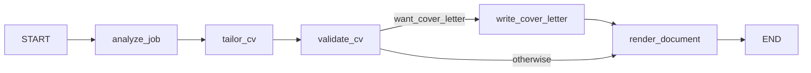

# Career Profile & Targeted CV Generator — Agent Design

## 1. Goal

Two-stage pipeline:

1. **Ingest** LinkedIn, GitHub, CV (docx/PDF), and free text → produce a single canonical **Personal Career Summary** (structured JSON + narrative).
2. **Target** — given a job post, use that summary to generate a **tailored CV** (and optionally a cover letter) that emphasizes relevant experience without fabricating anything.

This maps cleanly onto your existing Orchestrator/Analytic/Coding-style agent pattern — same LangGraph graph-of-agents shape, different domain.

---

## 2. Agent topology

```
                        ┌────────────────────┐
                        │   Orchestrator      │
                        │  (LangGraph graph)   │
                        └─────────┬───────────┘
              ┌───────────────────┼────────────────────┐
              ▼                   ▼                     ▼
      ┌───────────────┐   ┌───────────────┐    ┌────────────────┐
      │ Ingestion Agent │   │ Extraction    │    │ Synthesis Agent │
      │ (per-source)    │──▶│ Agent (LLM)   │──▶ │ (LLM)           │
      └───────────────┘   └───────────────┘    └────────┬────────┘
                                                          ▼
                                                 ┌─────────────────┐
                                                 │ CareerProfile    │
                                                 │ (canonical JSON) │
                                                 └────────┬────────┘
                                                          │
                        ┌─────────────────────────────────┘
                        ▼
              ┌───────────────────┐        ┌────────────────────┐
              │ Job Analysis Agent │───────▶│ CV Tailoring Agent  │
              │ (parses job post)  │        │ (LLM, generates CV) │
              └───────────────────┘        └──────────┬─────────┘
                                                        ▼
                                              ┌───────────────────┐
                                              │ Validation Agent   │
                                              │ (no-fabrication    │
                                              │  check + ATS check)│
                                              └──────────┬─────────┘
                                                          ▼
                                              ┌───────────────────┐
                                              │ Document Agent     │
                                              │ (docx/pdf render)  │
                                              └───────────────────┘
```

Each box is a node in a LangGraph `StateGraph`, same as your Backtesting/Discovery agents — this keeps it consistent with FUND's existing conventions (per-agent `SKILL.md`, shared Pydantic state, `interrupt()` for human review before final CV output).

---

## 3. Stage 1 — Ingestion Agents (per source)

Each source gets its own thin ingestion node that normalizes raw input into text/JSON before the LLM ever sees it. Keep parsing deterministic (no LLM) where possible — cheaper and more reliable.

| Source | Method | Notes |
|---|---|---|
| **LinkedIn** | User-provided **data export** (Settings → "Get a copy of your data") or manual paste of profile text | LinkedIn's ToS blocks scraping and there's no public profile-read API for personal apps — don't build a scraper. The official export gives you Positions, Education, Skills, Certifications, Recommendations as CSV/JSON. Implemented in Phase 2 (`src/tools/linkedin_export.py`) — see below. |
| **GitHub** | GitHub REST/GraphQL API (`api.github.com`) — repos, README content, languages, commit stats, pinned repos | You already have `api.github.com` in your allowed domains. Pull repo descriptions + top languages + README excerpts, not full source — keep token cost down. Coverage spans owned, organization, and contributed-to repos — see below. |
| **CV (docx)** | `python-docx` / your docx skill's read path | Extract text preserving section structure (headers as section boundaries). |
| **CV (PDF)** | `pdfplumber` or the pdf-reading skill | Watch for two-column CVs — plain text extraction can interleave columns; consider layout-aware extraction or page rasterization + vision fallback for complex layouts. |
| **Free text / paste** | Passthrough | e.g. person pastes bio or notes directly. |

Output of this stage: a list of `SourceDocument { source_type, raw_text, structured_fields? }`.

### GitHub source coverage & the attribution contract (Phase 1.f, 2026-07-21)

`/users/{u}/repos?type=owner` returns *only* repos under the personal username,
so work done inside organizations and contributions to other people's repos —
for many engineers the majority of their real output — were invisible. The
client (`src/tools/github_client.py`) now collects three tiers:

| Tier | Source | Detail fetched |
|---|---|---|
| **Owned** | the repo listing below, partitioned by `owner.login == u` | description, primary language, stars, `languages`, README excerpt |
| **Organization / collaborator** | the same listing's non-owned rows that pass the contribution probe, attributed to their owner; the org listing distinguishes *member of* from *collaborator on* | same as owned |
| **External contributions** | with `GITHUB_TOKEN`: GraphQL `user.repositoriesContributedTo(includeUserRepositories:false)` + `contributionsCollection.commitContributionsByRepository` (⚠️ defaults to the **last 12 months** — looped per year); without: REST `GET /search/issues?q=author:{u}+type:pr+is:merged`, aggregated per repo | contribution scope ("6 merged PRs; 41 commits") + PR titles, and **no README excerpt** |

Forks stay excluded — a fork is not evidence; the merged PR it produced is.
`GET /search/commits` is rejected: it counts forks and mirrors (57,068 "commits"
for a user with 778 real commit contributions).

**Attribution contract (anti-fabrication).** Rendering `pallets/flask` under the
same bare `## Repository:` heading as the user's own project invites synthesis
to credit them with the whole framework. So the source document is structured
into explicitly labelled sections — `## Owned repositories`,
`## Organization repositories (member of|collaborator on <org>)`, and
`## Contributions to external repositories (not owned by the user)` — external
entries are marked `(owned by others)` and carry only the contribution
evidence, and `skills/source-extraction/SKILL.md` gains an "Ownership vs.
contribution" rule: a contribution to a repo the user does not own is evidence
of *that contribution*, never of authorship or ownership of the project. README
excerpts are quoted line-by-line (`> `) because READMEs carry their own `##`
headings, which would otherwise read as section boundaries of this document and
blur the very labelling the contract depends on.

**Budget & degradation.** READMEs/languages are fetched only for owned and org
repos; external repos are ranked by contribution volume (not `updated`) and
capped by `GITHUB_MAX_EXTERNAL_REPOS`; the merged-PR search is paged once. A
403/429 on search logs a `WARNING` and degrades to owned + org repos rather than
failing the ingest, and `GITHUB_INCLUDE_CONTRIBUTIONS=false` skips the extra
calls entirely.

### Membership privacy & the contribution probe (Phase 1.g, 2026-07-21)

Phase 1.f was verified against public API responses, which hid two facts that
made its organization tier both incomplete and noisy.

**Private membership is the default.** `GET /users/{u}/orgs` returns *public*
memberships only. For the reference account it returned `[]` while the user
belonged to five organizations — so tier 2 could only ever surface the handful of
public org repos that happened to appear in the public repo listing, and the
document silently understated the user's entire employment history. Worse, the
14 repos Phase 1.f proudly labelled "external contributions **not owned by the
user**" were mostly repos of the user's *own companies*: unable to see the
affiliation, the client had inverted the attribution and undersold them.

The fix is a **self-token** path. `GET /user` resolves the token's identity on
every run; when it matches the ingested username the client switches to the
viewer endpoints, which see private memberships and private repos:

| | Third-party / no token | Self-token |
|---|---|---|
| Orgs | `GET /users/{u}/orgs` (public only) | `GET /user/orgs` |
| Repos | `GET /users/{u}/repos?type=all` | `GET /user/repos?affiliation=owner,organization_member,collaborator` (paged) |

The identity check is what makes this safe: a token issued to anyone other than
the ingested username never reaches a viewer endpoint, so it cannot surface a
third party's private data. `GITHUB_INCLUDE_PRIVATE=false` keeps private repos
out of the document while still discovering the memberships, and private repos
that are included are rendered with a `Visibility: private` line so tailoring
never offers one as a public portfolio link.

**Access is not contribution.** The same listing exposes the opposite failure:
`affiliation=collaborator` returns every repo the user was ever invited to. For
the reference account that was 88 repos, of which the user had committed to
exactly **one**. Rendering them all would hand the extractor 87 other people's
projects to write achievements from — a fabrication risk larger than the one the
labelled sections were built to solve. Every non-owned repo therefore has to
prove itself:

- repos already proven by the merged-PR search or the GraphQL commit counts pass
  for free;
- the rest cost one `GET /repos/{full}/commits?author={u}` probe each, bounded by
  `GITHUB_MAX_CONTRIBUTION_PROBES`; anything unproven is dropped, never assumed.

The GraphQL commit map was evaluated as the sole filter and rejected: it found 8
of the 26 repos the user had really committed to, because
`contributionsCollection` counts only default-branch commits under a matching
account email. The REST probe found all 26.

Survivors are capped by `GITHUB_MAX_ORG_REPOS`, most recent contribution first,
but **each organization keeps at least one repo before recency fills the rest** —
a straight recency sort dropped two 2021-era employers entirely, and a resume
needs the breadth of employers more than a fifth repo from the current one.

### LinkedIn data-export ingestion (Phase 2, 2026-07-21)

`src/tools/linkedin_export.py` parses the archive the person downloads from
LinkedIn themselves (or individual CSVs from it). Deterministic, offline, and
**no scraping** — there is no network call in this module at all, which is the
design constraint above expressed as code.

One upload → one `SourceDocument` (`source_type="linkedin"`,
`id="linkedin:<filename>"`) carrying both representations of the same data:

| Field | Contents | Consumer |
|---|---|---|
| `structured_fields` | Exported rows verbatim, grouped into `profile`, `positions`, `education`, `skills`, `certifications`, `recommendations_received` | The extraction prompt, as **authoritative records** |
| `raw_text` | Deterministic Markdown rendering of the same sections | The extraction prompt as readable context; also what a human sees in the archive |

Both are sent. The records are what the model must follow; the rendering keeps
a LinkedIn source shaped like every other source in the pipeline (and readable
in `data/sources/{run_id}/`). The duplication costs tokens on a large export
and is accepted for that reason.

Two properties of the real export drive the parser:

- **File names drift between export versions** (`Recommendations_Received.csv`
  vs `Recommendations Received.csv`), so a section is matched on a *normalized*
  stem (lowercased, non-alphanumerics collapsed), not an exact filename.
  Unrecognized members (ads, messages, connections) are skipped with a DEBUG
  log rather than guessed at.
- **Several CSVs open with a free-text `Notes:` preamble** before the header
  row, so the header is located by its columns (`Company Name`/`Title` for
  positions, etc.) instead of being assumed to be line 1. Blank cells are
  dropped rather than stored as `""`, so an absent field stays absent — the
  same contract §4's nullable-field rules enforce downstream.

An export with no recognizable section raises `ValueError` → HTTP 400, rather
than ingesting an empty source. The upload is archived *before* parsing (as CVs
are), so even a rejected export is on disk to inspect.

**Attribution.** Two exported record types are not the person's own claims and
are labelled as such in the rendering and in `skills/source-extraction/SKILL.md`:
profile **skills** are self-asserted (a skill, never an achievement), and
**recommendations** are written by other people (rendered under
"Recommendations received (written by other people)" with the author named).
This is the same anti-fabrication discipline the GitHub tier labelling above
exists to enforce.

---

## 4. Stage 2 — Extraction Agent (LLM)

One LLM call per source (or batched), converting messy raw text into a **common schema**. This is the "normalize" step — same idea as your Analytic Agent turning unstructured strategy docs into structured summaries.

```python
class Experience(BaseModel):
    company: str
    title: str
    start_date: str | None
    end_date: str | None
    location: str | None
    bullets: list[str]          # verbatim-ish achievements, not embellished
    source: str                 # "linkedin" | "cv" | "github"

class Project(BaseModel):
    name: str
    description: str
    technologies: list[str]
    role: str | None
    url: str | None
    source: str

class Skill(BaseModel):
    name: str
    category: str                # "language" | "framework" | "domain" | "tool"
    evidence_count: int          # how many sources/repos/roles support this

class CareerProfile(BaseModel):
    name: str
    headline: str | None
    contact: dict
    experiences: list[Experience]
    projects: list[Project]
    education: list[dict]
    skills: list[Skill]
    certifications: list[str]
    summary_narrative: str        # 2-3 paragraph human-readable synthesis
    raw_source_map: dict[str, str]  # traceability: claim -> source doc
```

Key design choice: **every field keeps a `source` pointer.** This is what makes stage 3's anti-fabrication check possible — you can always trace a bullet back to a real document.

### Structured-source prompt variant (Phase 2, 2026-07-21)

Most sources are prose (a CV, a README, pasted notes) and the model has to read
them. A LinkedIn data export is not: it is rows the person exported. So
`extraction_prompt` gained a `{structured}` slot, filled by
`extraction._structured_block` only when `SourceDocument.structured_fields` is
present, that hands the model the records as JSON and states they are
authoritative over the rendered text below them. Prose sources get an empty
block, so their prompt is byte-for-byte what it was before — one prompt module,
one node, no LinkedIn-specific branch in the graph.

### Nullable-field contract (Phase 1.e, 2026-07-21)

The anti-fabrication skill instructs the model to *leave an absent field empty
rather than invent a value*, so `null` is a **correct** extractor output, not an
error. The schema is therefore what yields: extraction-facing fields carry a
`mode="before"` validator (`NullableStr` → `""`, `NullableList` → `[]`, in
`src/models/schemas.py`) so a `null` coerces instead of rejecting the whole
payload.

| Model | Null-tolerant fields |
|---|---|
| `Experience` | `company`, `title`, `source`, `bullets` |
| `Project` | `name`, `description` (also defaults to `""`), `source`, `technologies` |
| `Skill` | `name`, `category` |
| `JobRequirements` | `required_skills`, `preferred_skills`, `responsibilities`, `keywords_for_ats` |

Models that are **not** LLM-extraction targets — `TailoredCV`, `ValidationFlag`,
`ValidationResult`, `CoverLetter` — stay strict: a `null` there is a real bug and
must still raise. `SKILL.md` is deliberately unchanged.

Ripple: `synthesis.build_raw_source_map` skips falsy claims, because once
descriptions can be `""` every description-less project would otherwise collide
on a single `""` key in the map the validation gate reads.

### Two-tier extraction resilience (Phase 1.e)

One `github_username` yields exactly **one** `SourceDocument` holding all repos,
so resilience at the source level cannot save individual repos. Two tiers:

1. **Item-level salvage** (`extract_one`, the primary net). The strict
   `SourceExtraction` remains the tool schema handed to the model — it is what
   steers the output — but the call uses `with_structured_output(...,
   include_raw=True)`, which *surfaces* a `ValidationError` in
   `{"parsed", "raw", "parsing_error"}` instead of raising. On the failure path
   the extraction is rebuilt from `raw.tool_calls[0]["args"]` field by field,
   validating `experiences`/`projects`/`skills` **one element at a time** and
   dropping only the failures (logged at WARNING with list index, `name`, and
   the pydantic message). If salvage recovers nothing usable — no tool call,
   unparseable args, or every item rejected — the original error is **re-raised**:
   a silently empty profile is worse than a 500.
2. **Source-level net** (`extract_source`, coarse last resort). A hard failure
   on one source (provider error, no parseable response at all) is logged and
   skipped so the surviving sources still produce a profile; if *every* source
   fails, the error is raised. This does not save individual repos — losing a
   source here still loses that whole document.

With the nullable-field contract in place tier 1 should rarely fire; it is
defense-in-depth for the next malformed field, not the primary remedy.

---

## 5. Stage 3 — Synthesis Agent (LLM)

Merges the per-source extractions into one `CareerProfile`:
- De-duplicates overlapping entries (same job listed in CV and LinkedIn).
- Resolves date/title conflicts by preferring the most detailed source, and flags conflicts back to the user rather than silently picking one.
- Writes `summary_narrative` — this is the reusable "elevator pitch" used later for tailoring.
- Infers `Skill.evidence_count` from cross-referencing GitHub language stats + CV mentions + LinkedIn skills list.

This `CareerProfile` JSON is your durable artifact — store it (Postgres/JSON file), it's what stage 2 (job targeting) consumes repeatedly without re-ingesting sources each time.

---

## 6. Stage 4 — Job Analysis Agent

Given a job post (pasted text or URL):
- Extracts: required skills, nice-to-haves, seniority level, key responsibilities, company/domain context.
- Produces a `JobRequirements` schema, same idea as `CareerProfile`.

```python
class JobRequirements(BaseModel):
    title: str
    company: str | None
    required_skills: list[str]
    preferred_skills: list[str]
    responsibilities: list[str]
    seniority: str | None
    keywords_for_ats: list[str]   # exact phrasing to mirror for ATS matching
```

---

## 7. Stage 5 — CV Tailoring Agent

This is the core generation step. Prompt structure (not code, but the shape that matters):

- **Input:** `CareerProfile` (full) + `JobRequirements`.
- **Instruction constraints** (critical, put these as hard rules in the system prompt):
  1. Only use facts present in `CareerProfile` — no new employers, dates, titles, or skills.
  2. Re-order and re-weight existing bullets toward job-relevant ones; don't invent new bullets.
  3. Rephrase bullets to mirror the job post's terminology *only when the underlying fact supports it* (e.g. if profile says "built distributed trading backtester" and job wants "distributed systems experience," it's fair to foreground that phrase — but don't claim technologies not evidenced).
  4. Select a subset of `experiences`/`projects` — not everything, prioritized by relevance score.
  5. Output structured JSON matching a `TailoredCV` schema, not raw prose — so the Document Agent can render it deterministically.

```python
class TailoredCV(BaseModel):
    headline: str
    summary: str                 # 2-4 sentences, job-specific framing
    selected_experiences: list[Experience]   # subset + reordered/reworded bullets
    selected_projects: list[Project]
    highlighted_skills: list[str]
    relevance_notes: dict[str, str]  # internal: why each item was chosen (for validation/debugging, not shown on CV)
```

---

## 8. Stage 6 — Validation Agent (anti-hallucination gate)

This is the piece worth not skipping. A second, separate LLM call (or even non-LLM diffing) that:
- Checks every bullet/skill in `TailoredCV` against `CareerProfile.raw_source_map`.
- Flags anything with no traceable source as `needs_review`.
- Optionally runs a simple string/embedding similarity check between generated bullets and original bullets to catch drift.

If using LangGraph, this is a natural `interrupt()` point — surface flagged items to the user for approval before rendering, consistent with the human-in-the-loop pattern you used in your earlier LangChain agent work.

---

## 9. Stage 7 — Document Agent

Renders `TailoredCV` → `.docx` (and/or PDF) using a template. This is a pure rendering step, no LLM — use `python-docx` with a template + style, or Claude's own docx skill if this is running inside Claude Code/Claude.ai rather than as a standalone service.

### Rendering & the render gate (Phase 3, 2026-07-21)

Implemented as two pieces, deliberately split so the decision and the drawing
are separately testable:

- **`src/tools/docx_renderer.py` — pure layout.** Everything it writes already
  exists in the `TailoredCV` / `CoverLetter` that the validation gate checked,
  so the renderer never adds, rewrites, or infers content; it only lays it out.
  Section order is fixed and mirrors the schema (name/contact header → headline
  → summary → experiences → projects → skills). `relevance_notes` is internal
  tailoring reasoning and is **not** rendered; empty sections are omitted
  entirely rather than emitted as empty headings.
- **`src/agents/document.py` — the gate.** `skip_reason()` answers *whether*
  rendering may happen; `render_documents()` drives the renderer. A CV whose
  claims validation could not trace back to the profile must not quietly become
  a polished file someone sends out, so a run with `needs_review` flags renders
  **nothing** unless the caller passes `approve_flagged` (Phase 3's review is
  client-side — the caller has already seen `validation.flags` in the response;
  Phase 4 replaces this with a graph `interrupt()`).

**Templates.** `DOCX_TEMPLATE` optionally points at a base `.docx` supplying
styles/theme/letterhead; content is always *appended* by the renderer, so no
placeholder-substitution engine is needed. A template lacking the built-in
`Heading 1` / `List Bullet` styles degrades to bold/plain paragraphs instead of
raising, and a configured-but-missing template falls back to python-docx's
default with a WARNING.

**PDF.** A second, separable step: the rendered `.docx` is converted by headless
LibreOffice (`LIBREOFFICE_BIN`, shipped in the Docker image as
`libreoffice-writer`), invoked with a throwaway `-env:UserInstallation` profile
because `HOME` is not reliably writable in a container. A missing binary, a
non-zero exit, or a timeout logs a WARNING and yields `None` — the `.docx` is
the guaranteed output and a PDF is never allowed to fail a tailoring run.
`RENDER_PDF=false` skips the attempt outright.

### Cover letter (design doc §1's optional second output)

`tailoring.generate_cover_letter` is an LLM node (`COVER_LETTER_MODEL`,
defaulting to `TAILORING_MODEL`) producing the `CoverLetter` schema. It is given
the profile, the `JobRequirements` **and** the already-tailored CV: that CV is
the set of facts deemed relevant to this posting, so the letter *connects* them
rather than re-selecting from scratch. It composes the `cover-letter` skill with
`anti-fabrication` (same pattern as tailoring), so the letter is bound by the
same no-invention rules as the CV — plus two rules the letter form makes
necessary: no inventing motivations or claims about the company, and no
restating third-party recommendations as the candidate's own claims.

---

## 10. Tech stack (matches your FUND stack)

- **Orchestration:** LangGraph `StateGraph`, one node per agent above, shared Pydantic state object.
- **Backend:** FastAPI, endpoints like `/ingest`, `/profile/{id}`, `/tailor` (job post in → CV out), SSE for streaming progress on long ingestion jobs — same pattern as your ATA's 17 REST/SSE endpoints.
- **Storage:** `CareerProfile` JSON per user in Postgres (or even just versioned JSON files if single-user) so re-tailoring for new job posts doesn't re-run ingestion.
- **Models:** Haiku for extraction (cheap, high-volume, per-source), Sonnet for synthesis + tailoring (needs judgment), optionally Opus for the validation/anti-hallucination pass since precision matters most there — the same tiering strategy you're already using for subagent cost control.
- **Frontend:** could reuse your React/Vite/TanStack scaffold — a simple 3-panel UI: sources → profile review/edit → job post + generated CV diff view.

---

## 11. Guardrails worth building in from day one

- **Traceability everywhere** — every generated sentence should be attributable to a source document. This isn't optional polish; it's what keeps the tailored CV honest.
- **Human review checkpoint** before final render — don't auto-send a generated CV without the person seeing it.
- **Conflict surfacing, not silent resolution** — if LinkedIn says one date and the CV says another, ask, don't guess.
- **No keyword-stuffing beyond what's true** — mirroring job-post terminology is fine; claiming unlisted skills is not.

---

## 12. Suggested build order

1. CareerProfile schema + docx/PDF/GitHub extraction (no LinkedIn yet — get the pipeline working on CV+GitHub first).
2. Synthesis agent + storage.
3. Job Analysis + Tailoring agent (the actual value-add).
4. Validation agent (do this before shipping to real use, not after).
5. LinkedIn export ingestion.
6. Document rendering + review UI.

---

## 13. Implementation notes — Phase 1 (2026-07-18)

Phase 1 implements §12 steps 1–4 as two **separate LangGraph `StateGraph`s**
sharing one schema module (`src/models/schemas.py`), since ingestion and
tailoring run at different times. State is a `TypedDict` per graph; node names
are verbs. There is no orchestrator graph yet — FastAPI routes invoke each
graph directly.

### Ingestion graph (`src/agents/ingestion_graph.py`)


- `ingest_sources` — validates non-empty sources (deterministic).
- `extract_source` — one Haiku call per `SourceDocument` →
  `SourceExtraction`; the `source` field of every extracted
  experience/project is **overwritten in code** with the document id, so
  traceability never depends on the model. Partial failures are salvaged
  item-by-item and a dead source is skipped rather than failing the run —
  see §4 "Two-tier extraction resilience".
- `synthesize_profile` — one Sonnet call merges extractions into a
  `CareerProfile`; dedupe + conflict surfacing happen in the prompt, but
  `raw_source_map` is built **deterministically** from the merged entries'
  `source` fields (`synthesis.build_raw_source_map`).
- `store_profile` — versioned JSON store (no LLM); when the run carries a
  `run_id` it also writes a copy of the profile to
  `data/output/{run_id}/output.json` and links the run's manifest to the new
  `profile_id`/`version` (`src/utils/run_store.py`).

**Run tracking / provenance.** Each `/ingest` execution is assigned a `run_id`
(the same value as `job_id`; generated if the client omits it). Before the graph
runs, `src/api/routes.py` archives every raw input under `data/sources/{run_id}/`
via `run_store.save_source_file` (CV bytes persisted **before** parsing so inputs
survive a later failure; GitHub serialized to `github.json`; the `free_text` /
LinkedIn-summary input to `linkedin-summary.txt`) and writes a `manifest.json`
indexing them (category, filename, size, sha256). This ties raw inputs → produced
output, which neither `job_id` (SSE only) nor `profile_id` (storage key) did
before. A `contextvars`-based `run_id` (`src/utils/logging_setup.py`) tags every
node's log line `[run:<run_id>]` for cross-step tracing, and
`SourceDocument.stored_path` links a source back to its archived file. Phase 2
added the dedicated LinkedIn path: an uploaded data export is archived under the
same `linkedin/` category (as `<original-name>.zip`, alongside the pasted
`linkedin-summary.txt` the `free_text` field still produces) and parsed by
`src/tools/linkedin_export.py`.

### Tailoring graph (`src/agents/tailoring_graph.py`)



- `analyze_job` — Sonnet → `JobRequirements`.
- `tailor_cv` — Sonnet with hard no-fabrication rules in the system prompt →
  `TailoredCV`.
- `write_cover_letter` (Phase 3) — Sonnet → `CoverLetter`; reached only via the
  conditional edge, i.e. when the caller asked for one, so the default path
  costs no extra LLM call.
- `render_document` (Phase 3) — no LLM; renders `.docx`/PDF into
  `data/documents/{tailor_id}/`. Renders nothing when the caller did not ask
  (`render`) or when the gate blocks it, reporting why in `render_skipped`.
- `validate_cv` — layered gate: (a) exact `raw_source_map` hit passes;
  (b) difflib similarity vs. original bullets ≥ threshold
  (`VALIDATION_SIMILARITY_THRESHOLD`, default 0.55) passes; (c) anything
  below threshold goes to an LLM cross-check; unsupported claims are
  returned as `needs_review` flags. Skill/experience/project membership
  checks are fully deterministic. In Phases 1–3 human review of flags is
  client-side; Phase 4 upgrades to a LangGraph `interrupt()` + checkpointer.
  Phase 3 gave the flags teeth: they now block `render_document` until the
  caller approves them (§9).

State carries `tailor_id` (one `/tailor` execution, the key of the document
store), the caller's `render` / `want_cover_letter` / `approved` flags, and the
results `cover_letter`, `documents`, `render_skipped`.

### Model tiering (env-configurable, `src/config.py`)

| Stage | Env var | Default |
|---|---|---|
| Extraction | `EXTRACTION_MODEL` | `claude-haiku-4-5-20251001` |
| Synthesis | `SYNTHESIS_MODEL` | `claude-sonnet-5` |
| Job analysis + tailoring | `TAILORING_MODEL` | `claude-sonnet-5` |
| Cover letter | `COVER_LETTER_MODEL` | `TAILORING_MODEL` (same task, same rules) |
| Validation cross-check | `VALIDATION_MODEL` | `claude-sonnet-5` (override to `claude-opus-4-8` for max precision) |

Every LLM node uses `make_llm(...).with_structured_output(<PydanticModel>)`
via the single factory `src/agents/llm.py:make_llm` — no free-form JSON
parsing anywhere. The factory follows the same method as FUND's
`AgentBase.get_llm()` (provider switch + lazy imports, configured via
`LLM_PROVIDER`, `LLM_API_KEY`, `LLM_TEMPERATURE`, `LLM_MAX_TOKENS`,
`LLM_BASE_URL`, `LLM_STREAM_TIMEOUT_S`), defaulting to `anthropic`; `model`
and `max_tokens` remain per-call arguments because models are tiered per
pipeline stage. Temperature is only passed when explicitly configured, since
current Claude models reject non-default sampling parameters.

### Agent skills (`SKILL.md`, Phase 1.b, 2026-07-20)

Each agent's hand-tuned reasoning (extraction fact/inference rules, synthesis
dedupe/conflict strategy, job-analysis decomposition, tailoring HARD RULES,
anti-fabrication cross-check) lives in a versioned **skill** under `skills/`
rather than a hardcoded prompt string, reusing FUND's skills mechanism verbatim
(`fund_models/skills.py`, consumed via `scan_skills`). Skills hold *reasoning*
(strategies, heuristics), never actions.

```
skills/
├── source-extraction/SKILL.md   # extraction
├── profile-synthesis/SKILL.md   # synthesis
├── job-analysis/SKILL.md        # job_analysis
├── cv-tailoring/SKILL.md        # tailoring (HARD RULES)
├── anti-fabrication/SKILL.md    # validation (also composed into tailoring + cover letter)
└── cover-letter/SKILL.md        # cover letter (Phase 3): shape + register
```

Each `SKILL.md` is YAML frontmatter (`name`, `description`) + a Markdown body.
`src/agents/skills.py` is a thin adapter over `fund_models.skills`:
`resolve_skill(name)` returns a body with frontmatter stripped (cached per
`SKILLS_DIR`); `skills_catalog()` returns the frontmatter-only summary
(`AgentBase.get_skills_context` format) for discovery.

Because the Phase 1 nodes are single-shot `with_structured_output` calls (not
tool-calling loops), skills are resolved **deterministically by node**: each
`src/chains/prompts/*_prompt.py` module keeps only structural scaffolding (a
`{skill}` slot + the `USER` template), and the node prepends
`resolve_skill("<node-skill>")` into that slot. The tailoring prompt composes
two skills (`cv-tailoring` + `anti-fabrication`). Resolution degrades
gracefully: a missing/empty `SKILLS_DIR` yields an empty body, so a node falls
back to its scaffolding and still runs — which is why the migration is
behavior-preserving (the skill body is the prior prompt text verbatim). FUND's
runtime `load_skill` tool and `AgentBase` are **not** used here; adopting them
for a genuinely tool-calling node is deferred to Phase 4 (§10/§11).

### Storage schema

Versioned JSON files (single-user; no Postgres):

```
data/
├── profiles/{profile_id}/
│   ├── v1.json      # CareerProfile serialized by Pydantic
│   ├── v2.json      # e.g. after a user edit via PUT /profile/{id}
│   └── latest       # plain-text pointer to the current version number
├── sources/{run_id}/            # per-run raw-input archive (src/utils/run_store.py)
│   ├── cv/<original-name>        # raw uploaded CV bytes (saved before parsing)
│   ├── github/github.json        # serialized GitHub SourceDocument
│   ├── linkedin/linkedin-summary.txt  # the free_text / LinkedIn-summary input
│   ├── linkedin/<export-name>.zip     # uploaded LinkedIn data export (Phase 2)
│   └── manifest.json             # index (category, filename, size, sha256) + profile_id/version
├── output/{run_id}/output.json   # copy of the synthesized profile for the run
└── documents/{tailor_id}/        # rendered documents (Phase 3, src/utils/document_store.py)
    ├── cv.docx / cv.pdf
    ├── cover-letter.docx / cover-letter.pdf
    └── tailor.json               # the run's tailored CV, validation result, cover letter
```

`profile_store.py` owns `profiles/`; `run_store.py` owns `sources/` and
`output/`; `document_store.py` owns `documents/`. `run_id` = one ingest
execution; `tailor_id` = one `/tailor` execution; `profile_id` = an evolving
profile that may span runs. Document filenames are fixed per (kind, format) and
`tailor_id` is restricted to `[A-Za-z0-9_-]{1,64}`, so a `GET /document` request
can never address a path outside its own directory. Raw CVs are **retained** here (previously deleted after
parsing) — see OPERATIONS.md for the retention/privacy note.

### Merge flow (planned — Phase 1.d)

> Design only; not yet implemented. Recorded here so the roadmap and the
> component design stay in one place (see PLAN.md → Phase 1.d).

Ingestion is last-write-wins: `synthesize_profile` only ever sees the current
run's extractions, so re-ingesting into the same `profile_id` (Phase 1.c) never
unions with prior runs. The **merge** flow combines the synthesized snapshots two
or more prior runs already wrote (`data/output/{run_id}/output.json`) into one
new profile version — no CV re-parse, no per-source Haiku re-extraction.


- `load_run_outputs` — deterministic; a new `run_store.load_output(run_id)`
  (mirroring `save_output`) loads each requested run's `output.json` into a
  `CareerProfile`. Missing snapshot → 404.
- `merge_profiles` — **reuses synthesis**: one `SYNTHESIS_MODEL` call with the
  `profile-synthesis` skill and structured output `CareerProfile`, over a merge
  variant of the synthesis USER prompt that frames the inputs as
  already-synthesized profiles rather than per-source extractions. It dedupes
  entries describing the same job/project across profiles and **surfaces** cross-
  profile disagreements into `conflicts` (unioning each input's existing
  conflicts) — never silently resolving them, exactly as first-pass synthesis
  does. `raw_source_map` is rebuilt deterministically via
  `synthesis.build_raw_source_map`; every entry keeps its original `source`, so
  claim→source traceability is preserved across the merge. A purely deterministic
  list-union is rejected — it would duplicate the same job across sources and drop
  conflict surfacing, the core anti-fabrication guarantee.
- `store_profile` — reused from ingestion. The merge is assigned its own fresh
  `run_id`; the merged profile is stored as a new version of the target
  `profile_id` (`profile_store.save_profile`) and copied to
  `data/output/{run_new}/output.json` (`run_store.save_output`). The merge run's
  `manifest.json` records `merged_from: [run_ids]` (a new optional field on
  `write_manifest`) instead of raw source files, and links to the produced
  `profile_id`/`version`. This keeps `run_id` = one execution (here, one merge)
  and `profile_id` = the evolving profile, consistent with the rest of §13.

Exposed as `POST /merge` (`{run_ids: [...], profile_id?: ...}`) — a dedicated
endpoint rather than an `/ingest` mode, since a merge takes no file upload and its
inputs are prior runs referenced by id.

### API / SSE

FastAPI app factory (`src/api/main.py`) + routes (`src/api/routes.py`).
Long-running ingestion progress is streamed per-node over SSE using an
in-process job registry (`dict[job_id, asyncio.Queue]`); the graph runs in a
worker thread and publishes node names via `loop.call_soon_threadsafe`. The
client may supply its own `job_id` form field so it can subscribe before
POSTing. `POST /tailor` is synchronous (no SSE) and, since Phase 3, returns a
`tailor_id` whose rendered files are downloaded from
`GET /document/{tailor_id}?kind=&format=` — served with `FileResponse` from the
document store, 404 when that file was not rendered. Everything ships in **one
Docker container** (python:3.11-slim + `libreoffice-writer` for PDF, uvicorn on
0.0.0.0:8000, `data/` volume-mounted).
