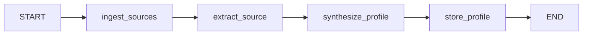
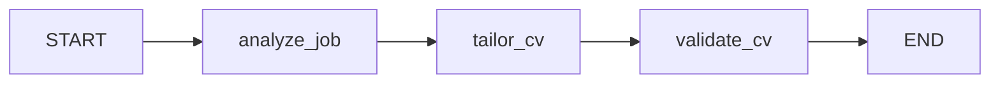

# Career Profile & Targeted CV Generator — Agent Design

## 1. Goal

Two-stage pipeline:

1. **Ingest** LinkedIn, GitHub, CV (docx/PDF), and free text → produce a single canonical **Personal Career Summary** (structured JSON + narrative).
2. **Target** — given a job post, use that summary to generate a **tailored CV** (and optionally a cover letter) that emphasizes relevant experience without fabricating anything.

This maps cleanly onto your existing Orchestrator/Analytic/Coding-style agent pattern — same LangGraph graph-of-agents shape, different domain.

---

## 2. Agent topology

```
                        ┌────────────────────┐
                        │   Orchestrator      │
                        │  (LangGraph graph)   │
                        └─────────┬───────────┘
              ┌───────────────────┼────────────────────┐
              ▼                   ▼                     ▼
      ┌───────────────┐   ┌───────────────┐    ┌────────────────┐
      │ Ingestion Agent │   │ Extraction    │    │ Synthesis Agent │
      │ (per-source)    │──▶│ Agent (LLM)   │──▶ │ (LLM)           │
      └───────────────┘   └───────────────┘    └────────┬────────┘
                                                          ▼
                                                 ┌─────────────────┐
                                                 │ CareerProfile    │
                                                 │ (canonical JSON) │
                                                 └────────┬────────┘
                                                          │
                        ┌─────────────────────────────────┘
                        ▼
              ┌───────────────────┐        ┌────────────────────┐
              │ Job Analysis Agent │───────▶│ CV Tailoring Agent  │
              │ (parses job post)  │        │ (LLM, generates CV) │
              └───────────────────┘        └──────────┬─────────┘
                                                        ▼
                                              ┌───────────────────┐
                                              │ Validation Agent   │
                                              │ (no-fabrication    │
                                              │  check + ATS check)│
                                              └──────────┬─────────┘
                                                          ▼
                                              ┌───────────────────┐
                                              │ Document Agent     │
                                              │ (docx/pdf render)  │
                                              └───────────────────┘
```

Each box is a node in a LangGraph `StateGraph`, same as your Backtesting/Discovery agents — this keeps it consistent with FUND's existing conventions (per-agent `SKILL.md`, shared Pydantic state, `interrupt()` for human review before final CV output).

---

## 3. Stage 1 — Ingestion Agents (per source)

Each source gets its own thin ingestion node that normalizes raw input into text/JSON before the LLM ever sees it. Keep parsing deterministic (no LLM) where possible — cheaper and more reliable.

| Source | Method | Notes |
|---|---|---|
| **LinkedIn** | User-provided **data export** (Settings → "Get a copy of your data") or manual paste of profile text | LinkedIn's ToS blocks scraping and there's no public profile-read API for personal apps — don't build a scraper. The official export gives you Positions, Education, Skills, Certifications, Recommendations as CSV/JSON. |
| **GitHub** | GitHub REST/GraphQL API (`api.github.com`) — repos, README content, languages, commit stats, pinned repos | You already have `api.github.com` in your allowed domains. Pull repo descriptions + top languages + README excerpts, not full source — keep token cost down. |
| **CV (docx)** | `python-docx` / your docx skill's read path | Extract text preserving section structure (headers as section boundaries). |
| **CV (PDF)** | `pdfplumber` or the pdf-reading skill | Watch for two-column CVs — plain text extraction can interleave columns; consider layout-aware extraction or page rasterization + vision fallback for complex layouts. |
| **Free text / paste** | Passthrough | e.g. person pastes bio or notes directly. |

Output of this stage: a list of `SourceDocument { source_type, raw_text, structured_fields? }`.

---

## 4. Stage 2 — Extraction Agent (LLM)

One LLM call per source (or batched), converting messy raw text into a **common schema**. This is the "normalize" step — same idea as your Analytic Agent turning unstructured strategy docs into structured summaries.

```python
class Experience(BaseModel):
    company: str
    title: str
    start_date: str | None
    end_date: str | None
    location: str | None
    bullets: list[str]          # verbatim-ish achievements, not embellished
    source: str                 # "linkedin" | "cv" | "github"

class Project(BaseModel):
    name: str
    description: str
    technologies: list[str]
    role: str | None
    url: str | None
    source: str

class Skill(BaseModel):
    name: str
    category: str                # "language" | "framework" | "domain" | "tool"
    evidence_count: int          # how many sources/repos/roles support this

class CareerProfile(BaseModel):
    name: str
    headline: str | None
    contact: dict
    experiences: list[Experience]
    projects: list[Project]
    education: list[dict]
    skills: list[Skill]
    certifications: list[str]
    summary_narrative: str        # 2-3 paragraph human-readable synthesis
    raw_source_map: dict[str, str]  # traceability: claim -> source doc
```

Key design choice: **every field keeps a `source` pointer.** This is what makes stage 3's anti-fabrication check possible — you can always trace a bullet back to a real document.

---

## 5. Stage 3 — Synthesis Agent (LLM)

Merges the per-source extractions into one `CareerProfile`:
- De-duplicates overlapping entries (same job listed in CV and LinkedIn).
- Resolves date/title conflicts by preferring the most detailed source, and flags conflicts back to the user rather than silently picking one.
- Writes `summary_narrative` — this is the reusable "elevator pitch" used later for tailoring.
- Infers `Skill.evidence_count` from cross-referencing GitHub language stats + CV mentions + LinkedIn skills list.

This `CareerProfile` JSON is your durable artifact — store it (Postgres/JSON file), it's what stage 2 (job targeting) consumes repeatedly without re-ingesting sources each time.

---

## 6. Stage 4 — Job Analysis Agent

Given a job post (pasted text or URL):
- Extracts: required skills, nice-to-haves, seniority level, key responsibilities, company/domain context.
- Produces a `JobRequirements` schema, same idea as `CareerProfile`.

```python
class JobRequirements(BaseModel):
    title: str
    company: str | None
    required_skills: list[str]
    preferred_skills: list[str]
    responsibilities: list[str]
    seniority: str | None
    keywords_for_ats: list[str]   # exact phrasing to mirror for ATS matching
```

---

## 7. Stage 5 — CV Tailoring Agent

This is the core generation step. Prompt structure (not code, but the shape that matters):

- **Input:** `CareerProfile` (full) + `JobRequirements`.
- **Instruction constraints** (critical, put these as hard rules in the system prompt):
  1. Only use facts present in `CareerProfile` — no new employers, dates, titles, or skills.
  2. Re-order and re-weight existing bullets toward job-relevant ones; don't invent new bullets.
  3. Rephrase bullets to mirror the job post's terminology *only when the underlying fact supports it* (e.g. if profile says "built distributed trading backtester" and job wants "distributed systems experience," it's fair to foreground that phrase — but don't claim technologies not evidenced).
  4. Select a subset of `experiences`/`projects` — not everything, prioritized by relevance score.
  5. Output structured JSON matching a `TailoredCV` schema, not raw prose — so the Document Agent can render it deterministically.

```python
class TailoredCV(BaseModel):
    headline: str
    summary: str                 # 2-4 sentences, job-specific framing
    selected_experiences: list[Experience]   # subset + reordered/reworded bullets
    selected_projects: list[Project]
    highlighted_skills: list[str]
    relevance_notes: dict[str, str]  # internal: why each item was chosen (for validation/debugging, not shown on CV)
```

---

## 8. Stage 6 — Validation Agent (anti-hallucination gate)

This is the piece worth not skipping. A second, separate LLM call (or even non-LLM diffing) that:
- Checks every bullet/skill in `TailoredCV` against `CareerProfile.raw_source_map`.
- Flags anything with no traceable source as `needs_review`.
- Optionally runs a simple string/embedding similarity check between generated bullets and original bullets to catch drift.

If using LangGraph, this is a natural `interrupt()` point — surface flagged items to the user for approval before rendering, consistent with the human-in-the-loop pattern you used in your earlier LangChain agent work.

---

## 9. Stage 7 — Document Agent

Renders `TailoredCV` → `.docx` (and/or PDF) using a template. This is a pure rendering step, no LLM — use `python-docx` with a template + style, or Claude's own docx skill if this is running inside Claude Code/Claude.ai rather than as a standalone service.

---

## 10. Tech stack (matches your FUND stack)

- **Orchestration:** LangGraph `StateGraph`, one node per agent above, shared Pydantic state object.
- **Backend:** FastAPI, endpoints like `/ingest`, `/profile/{id}`, `/tailor` (job post in → CV out), SSE for streaming progress on long ingestion jobs — same pattern as your ATA's 17 REST/SSE endpoints.
- **Storage:** `CareerProfile` JSON per user in Postgres (or even just versioned JSON files if single-user) so re-tailoring for new job posts doesn't re-run ingestion.
- **Models:** Haiku for extraction (cheap, high-volume, per-source), Sonnet for synthesis + tailoring (needs judgment), optionally Opus for the validation/anti-hallucination pass since precision matters most there — the same tiering strategy you're already using for subagent cost control.
- **Frontend:** could reuse your React/Vite/TanStack scaffold — a simple 3-panel UI: sources → profile review/edit → job post + generated CV diff view.

---

## 11. Guardrails worth building in from day one

- **Traceability everywhere** — every generated sentence should be attributable to a source document. This isn't optional polish; it's what keeps the tailored CV honest.
- **Human review checkpoint** before final render — don't auto-send a generated CV without the person seeing it.
- **Conflict surfacing, not silent resolution** — if LinkedIn says one date and the CV says another, ask, don't guess.
- **No keyword-stuffing beyond what's true** — mirroring job-post terminology is fine; claiming unlisted skills is not.

---

## 12. Suggested build order

1. CareerProfile schema + docx/PDF/GitHub extraction (no LinkedIn yet — get the pipeline working on CV+GitHub first).
2. Synthesis agent + storage.
3. Job Analysis + Tailoring agent (the actual value-add).
4. Validation agent (do this before shipping to real use, not after).
5. LinkedIn export ingestion.
6. Document rendering + review UI.

---

## 13. Implementation notes — Phase 1 (2026-07-18)

Phase 1 implements §12 steps 1–4 as two **separate LangGraph `StateGraph`s**
sharing one schema module (`src/models/schemas.py`), since ingestion and
tailoring run at different times. State is a `TypedDict` per graph; node names
are verbs. There is no orchestrator graph yet — FastAPI routes invoke each
graph directly.

### Ingestion graph (`src/agents/ingestion_graph.py`)



- `ingest_sources` — validates non-empty sources (deterministic).
- `extract_source` — one Haiku call per `SourceDocument` →
  `SourceExtraction`; the `source` field of every extracted
  experience/project is **overwritten in code** with the document id, so
  traceability never depends on the model.
- `synthesize_profile` — one Sonnet call merges extractions into a
  `CareerProfile`; dedupe + conflict surfacing happen in the prompt, but
  `raw_source_map` is built **deterministically** from the merged entries'
  `source` fields (`synthesis.build_raw_source_map`).
- `store_profile` — versioned JSON store (no LLM).

### Tailoring graph (`src/agents/tailoring_graph.py`)



- `analyze_job` — Sonnet → `JobRequirements`.
- `tailor_cv` — Sonnet with hard no-fabrication rules in the system prompt →
  `TailoredCV`.
- `validate_cv` — layered gate: (a) exact `raw_source_map` hit passes;
  (b) difflib similarity vs. original bullets ≥ threshold
  (`VALIDATION_SIMILARITY_THRESHOLD`, default 0.55) passes; (c) anything
  below threshold goes to an LLM cross-check; unsupported claims are
  returned as `needs_review` flags. Skill/experience/project membership
  checks are fully deterministic. In Phases 1–3 human review of flags is
  client-side; Phase 4 upgrades to a LangGraph `interrupt()` + checkpointer.

### Model tiering (env-configurable, `src/config.py`)

| Stage | Env var | Default |
|---|---|---|
| Extraction | `EXTRACTION_MODEL` | `claude-haiku-4-5-20251001` |
| Synthesis | `SYNTHESIS_MODEL` | `claude-sonnet-5` |
| Job analysis + tailoring | `TAILORING_MODEL` | `claude-sonnet-5` |
| Validation cross-check | `VALIDATION_MODEL` | `claude-sonnet-5` (override to `claude-opus-4-8` for max precision) |

Every LLM node uses `make_llm(...).with_structured_output(<PydanticModel>)`
via the single factory `src/agents/llm.py:make_llm` — no free-form JSON
parsing anywhere. The factory follows the same method as FUND's
`AgentBase.get_llm()` (provider switch + lazy imports, configured via
`LLM_PROVIDER`, `LLM_API_KEY`, `LLM_TEMPERATURE`, `LLM_MAX_TOKENS`,
`LLM_BASE_URL`, `LLM_STREAM_TIMEOUT_S`), defaulting to `anthropic`; `model`
and `max_tokens` remain per-call arguments because models are tiered per
pipeline stage. Temperature is only passed when explicitly configured, since
current Claude models reject non-default sampling parameters.

### Storage schema

Versioned JSON files (single-user; no Postgres):

```
data/profiles/{profile_id}/
├── v1.json      # CareerProfile serialized by Pydantic
├── v2.json      # e.g. after a user edit via PUT /profile/{id}
└── latest       # plain-text pointer to the current version number
```

### API / SSE

FastAPI app factory (`src/api/main.py`) + routes (`src/api/routes.py`).
Long-running ingestion progress is streamed per-node over SSE using an
in-process job registry (`dict[job_id, asyncio.Queue]`); the graph runs in a
worker thread and publishes node names via `loop.call_soon_threadsafe`. The
client may supply its own `job_id` form field so it can subscribe before
POSTing. Everything ships in **one Docker container** (python:3.11-slim,
uvicorn on 0.0.0.0:8000, `data/` volume-mounted).
